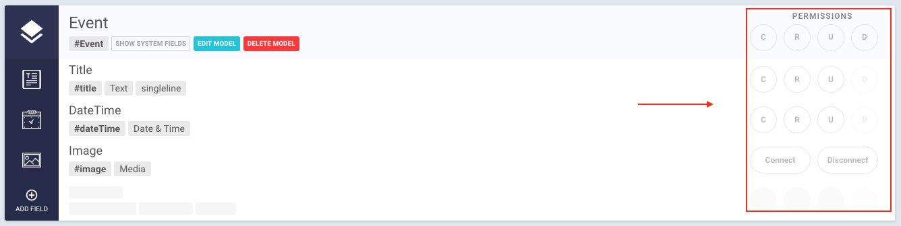

# Concepts

A quick overview on the concepts of GraphCMS.

## Projects

Your content lives within a project. In a project you can:

* Define the shape of your content by adding `content models`
* Add `fields` to your models
* Manage and browse your project´s content
* Upload and assign media files
* Invite others to your team
* Track the activities of your team
* Create `permanent auth tokens` for your applications and content consumers
* Use the integrated GraphiQL playground to run queries and mutations against your project´s endpoint

## Content Models

Content models describe the shape of your content. They consist of several fields while each field can store various types of data (e.g: text, numbers or images). A field can also be a reference to another model, which allows you to build a complex content graph. The fields you associate with a model will also define how its content editing user interface will look like.

## Fields

Fields are the building blocks of your content models. Each field type can store a specific type of data.
GraphCMS offers the following field types:

* **Text:** names, titles, list of names, comments, formatted text, markdown...
* **Number:** ID, product number, price, quantity...
* **Boolean:** true or false, yes or no...
* **Date:** post date, opening hours, date of birth...
* **Enum:** selection on a predefined set of values
* **JSON:** data in JSON format
* **Color:** rgba or hex color string
* **Location:** geographic coordinates: latitude and longitude
* **Assets:** any asset, e.g. image, video...
* **Relation:** for referencing other content models. E.g. the author of a blog post

## Webhooks

!!! hint " "
    Webhooks are available starting from the **Basic Plan**. New Projects will be started in a two-week trial, where you get access to every higher-tier feature like Webhooks or Content Localization.

[Webhooks](http://www.webhooks.org/) are a powerful concept that enable you to execute your own business logic in case of specified events.

In GraphCMS, they allow you to define triggers on your content models, so you can run, for example, custom code if your content changes.

### Setting up a Webhook

Creating a webhook in GraphCMS is straight forward. Switch to the `WEBHOOKS` view and click the `ADD WEBHOOK` button.

#### 1. Trigger

Select the content model and the action that should trigger the webhook event. You can choose between the actions `CREATE`, `UPDATE` and `DELETE`.

> **Example**
>
>  Trigger a webhook on model `Post`, if there was an `UPDATE` on the content of the model

#### 2. Payload

Define the payload that should be transfered with your webhook event. This is done simply with a GraphQL query.

> **Example for `CREATE` trigger**
>
> `{ createdNode { id title content } }`

<!-- -->
> **Example for `UPDATE` trigger**
>
> `{
  changedFields
  previousValues {
    id
    title
    content
  }
  updatedNode {
    id
    title
    content
  }
}`

#### 3. Webhook Settings

Here you can define the endpoint URL for your custom business logic code. This could be, for example, an [AWS lambda function](https://aws.amazon.com/de/lambda/details/).

You can also define if your webhook is triggered synchronously or asynchronously. I.e., if you set up a synchronous `CREATE` webhook for model `Post`, a create mutation for this model will return after your custom business logic has finished.

Your webhook will be active by default. You can disable it by clicking on the switch in the webhook´s entry.

!!! Warning ""
    If you change your content models or modify your fields, remember to update affected webhooks accordingly! This does not happen automatically.

## GraphQL Endpoints

Any GraphCMS project comes with two GraphQL endpoints:

* The `simple endpoint` serves your content with a simple GraphQL schema for use with GraphQL clients like [Apollo](http://dev.apollodata.com/), [Apollo iOS](https://github.com/apollostack/apollo-ios) or [Lokka](https://github.com/kadirahq/lokka)
* The `relay endpoint` serves your content with a relay conform GraphQL schema for [data driven react applications](https://facebook.github.io/relay/)

## Using Permissions

All of your content is private by default, which means that your content can't be accessed outside of the CMS. With our *Permission System*, you can configure CRUD-Operations (Create/Read/Update/Delete) either for models or for each field individually. This gives you control over what can be queried, updated or created from your generated content API.

### Permission View

The Permission settings can be found next to each model and field in the *Content* view.

Each CRUD-Operation has a dedicated button to toggle it on or off. `Create`, `Read` and `Update` can be toggled for the entire model or for every field individually. `Delete` can only be toggled for the whole model, since you can't delete fields individually.

The Permissions for Assets and Relations look a little different. They have the option to `Connect` and  `Disconnect`. 

If you enable the `Connect` toggle button, you will be able to add entries to the relation (e.g. `mutation { addToAssetEventPicture(...) }` - adding a picture to an event). 

If you enable the `Disconnect` toggle button, you will be able to remove entries from a relation (e.g. `mutation { removeFromEventParticipant(...) }` - removing a participant from an event).

### Creating and modifying data from your API

Whenever you are trying to create or modify your content via your API, you need to make sure to enable all the necessary permissons for these operations. For example: You want to create a new entry for your model. Make sure you have the create permisson toggled for your input fields in order for it to work.

### Testing your permissions

The easiest way to test your permissions is to copy and paste one of your endpoint URLs in a new browser tab. This will let you browse your API with the permissions you defined.

Your endpoints can be found under `Settings > Endpoints`.

Trying to Create, Read or Update a model or field which is not made available through permissions will result in an `Insufficient Permission` error.

## Permanent Auth Tokens

To connect your client applications with your GraphCMS backend, you will need to create `permanent auth tokens`. This will allow your external client to:

* `CREATE` new content entries
* `READ` existing content entries
* `UPDATE` existing content entries
* `DELETE` existing content entries

[How to work with permanent auth tokens](guides/Using_permanent_auth_tokens)

!!! warning ""
    Be careful! Anyone that gains access to one of your tokens will be able to execute all of these operations and manipulate your content. So it is never a good idea to store a token on the client side, i.e. a JavaScript client application.

    We will soon release a feature that will allow you to create `read-only tokens`, so even if someone gains access to such a token, your data will be safe from manipulation.

## System Artifacts

Each GraphCMS project comes with a few system artifacts, that users should be aware of. Those are models and fields that are created automatically by the system.

### Asset Model

The `Asset` system model is where your uploaded files get stored. Each time you assign an asset field to one of your content models, a relation to this model is created.

The fields of the `Asset` model are:

* `fileName` the name of the file
* `handle` the unique identifier of the file
* `url` the public url of the file, which is always media.graphcms.com/`handle`
* `size` the size of the file
* `mimeType` the internet asset type of the file
* `isPublic` a flag that indicates if the file is available for the public (currently always `true`)

### System Fields

Each content model in GraphCMS has the following system fields by default:

* `id` stores the unique identifier of a content entry
* `createdAt` the date the content entry was created
* `updatedAt` the date the content entry was updated the last time
* `isPublished` indicates if the content entry is published ([see here](/guides/Publishing_workflow))
