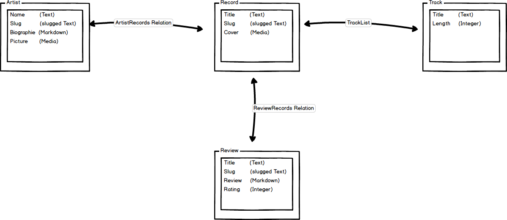
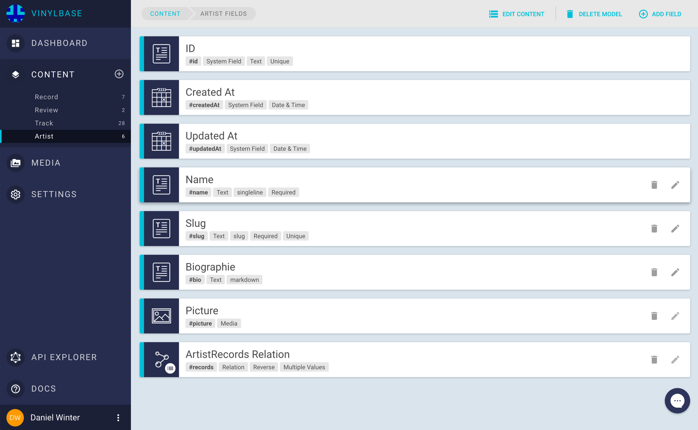

# Examples

## Serverside rendered App with Next.js and Apollo

In this example we are going to build a simple serverside rendered Application backed by GraphCMS using [Next.js](https://zeit.co/) and [Apollo](http://www.apollodata.com/).

!!! hint ""
    If you want to follow along, check out our [Getting started Guide](Getting_Started) to setup you own content model to play around and fill it with your own data.


The app will be a simple collection of music records reviews. To keep things simple, the data model is not really complex:

* Each `Review` belongs to a `Record`
* A `Record` has a list of `Tracks`
* An `Artist` has multiple `Records`

The screenshot below shows the relations and fields of the four models:



### Setting up the content models in GraphCMS

To setup these models in GraphCMS we create a new Project named "Vinylbase" and add our four content models:


Then we add all the fields to every content model from the schema above. This should look similar to the following screenshots.
You can see the relevant attributes like type, unique constraints etc. for every field below each field name.




Next we need a way to authenticate the app to fetch data from the GraphCMS Project via the API. Per default all data is private, so you cannot fetch data without a valid token outside of the GraphCMS webapp.
GraphCMS handles this with [Permanent Auth Tokens](permanent-auth-tokens).

To create a new auth token go to Settings, insert a token name into the AUTH TOKENS section an press `ADD TOKEN`.


Now you are good to go and we can start implementing our app.

### Implementing the app


!!! hint ""
    You can checkout the source code for this project [here](https://github.com/GraphCMS/Vinylbase)

For the app we will use Next.js, which is a minimalistic framework for server-rendered React applications.
Data fetching will be done with Apollo, a wonderful GraphQL client which runs in nearly every environment.
Apollo allow you to query and mutate your data using plain GraphQL queries. This makes the development process easy since you can test your queries in an IDE like [GraphiQL](https://github.com/graphql/graphiql) and paste them directly into your project. Apollo manages all stuff like caching, prefetching and optimistic UI.

As a starting point we use [this](https://github.com/ads1018/next-apollo-example) project (thanks [Adam Soffer](http://twitter.com/adamSoffer)).
This projects is a skeleton for using Apollo within a Next.js application. To allow this, it wraps the pages within a higher order component ([HOC](https://facebook.github.io/react/docs/higher-order-components.html)), which will pass down query results from Apollo directly into the component. This is realized by Apollos [getDataFromTree](http://dev.apollodata.com/react/server-side-rendering.html#getDataFromTree) function, which checks the React tree on which data it needs to be rendered. This function returns a Promise when the data is ready in the Apollo Store, so the page can be rendered and passed down to the client.

#### Setting up Apollo

First we need to init the Apollo client to set the API endpoint and setup authorization. This is done within the `createClient` function within `/lib/initClient.js`.
Here we use the middleware feature of the Apollo networkInterface by simply adding our token.

For more information checkout the [Docs](http://dev.apollodata.com/react/auth.html)

```
function createClient (headers) {
  const GRAPHCMS_API = process.env.GRAPHCMS_API
  const TOKEN = process.env.TOKEN

  if (!GRAPHCMS_API || !TOKEN) {
    throw new Error(`Environment variables "GRAPHCMS_API" or "TOKEN" missing`)
  }

  const networkInterface = createNetworkInterface({
    uri: GRAPHCMS_API,
    ops: {
      credentials: 'same-origin'
    }
  })

  networkInterface.use([{
    applyMiddleware (req, next) {
      if (!req.options.headers) {
        req.options.headers = {}
      }

      req.options.headers.authorization = `Bearer ${TOKEN}`
      next()
    }
  }])

  return new ApolloClient({ networkInterface })
}

```

#### Getting data within the pages

To use Apollo within our pages we need to wrap them with the higher order component `withData` defined in `/lib/withData`. An example can be seen in the `index.js` page within the `pages` folder. This is the starting point of the app and will display a grid of reviews.
To build the query for the required data we switch to the *API-Explorer* within our GraphCMS project and choose "Simple" as endpoint.
Here we can write and test our first query to request all existing reviews:


If the query works and returns all the data we need, we can copy it into the `allReviews` query in the next snippet (`/pages/index.js`).
To create the Apollo query, we use the `react-apollo` library which wraps and passes the fetched data into the `AllReviews` component. This data is available as a prop named `data` by default.
To ensure the Apollo client is available here, we need to wrap this with the `withData` higher order component as discussed above.
An example is shown below:

```
function AllReviews ({ url: { pathname }, loading, data: { allReviews } }) {
  return (
    <App>
      <Nav pathname={pathname} />
      {
        loading ? <Loading /> : (
          <div>
            <Header
              title='Vinylbase'
              subLine='The best music reviews on the interwebs'
              pageImage='/static/records.svg'
              isIcon
            />
            <section>
              <Grid entries={allReviews} type='reviews' />
            </section>
          </div>
        )
       }
    </App>
  )
}

const allReviews = gql`
  query allReviews {
    allReviews(orderBy: createdAt_DESC) {
      id
      slug
      createdAt
      title
    }
  }`

export default withData(graphql(allReviews)(AllReviews))

```
