# Getting Started

Building a content API with GraphCMS is easy! In this getting started guide we will present how to quickly build a content API for a music blog.

## Creating a Project

We start off by creating a new project called `Vinylbase`.

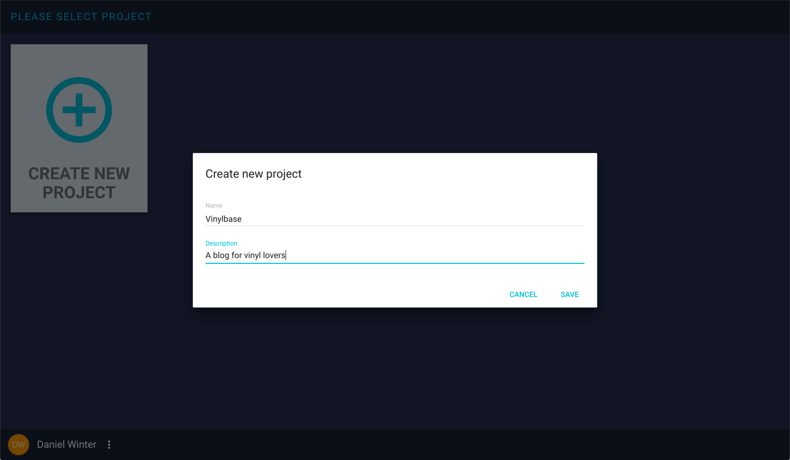

!!! Hint ""
    Project names can contain only alphanumeric characters and whitespaces.

## Creating Content Models

After creating the project, switch to the `CONTENT` view and use the `ADD MODEL` button to add the following models:

* `Arist`
* `Record`
* `Review`
* `Record Store`

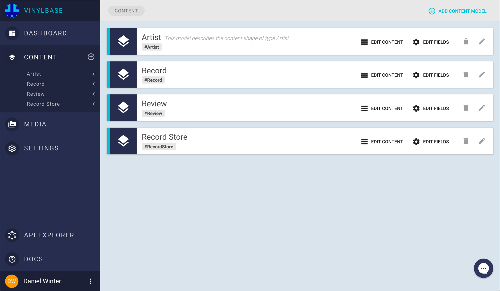

!!! Hint ""
    API IDs for models must start with a capital letter and can contain only alphanumeric characters. No whitespaces allowed.

## Adding Fields to your Content Models

Before we can populate our content models with content, we need to add fields to them. This can be done by clicking on the small gear icon next to the content model in the sidebar or by clicking on a content model and then clicking the `EDIT FIELDS` button.

Doing so will open up the `Field Wizard`. Here we can specify the types, appearance, API identifiers and additional rules for the fields we add to our content model.

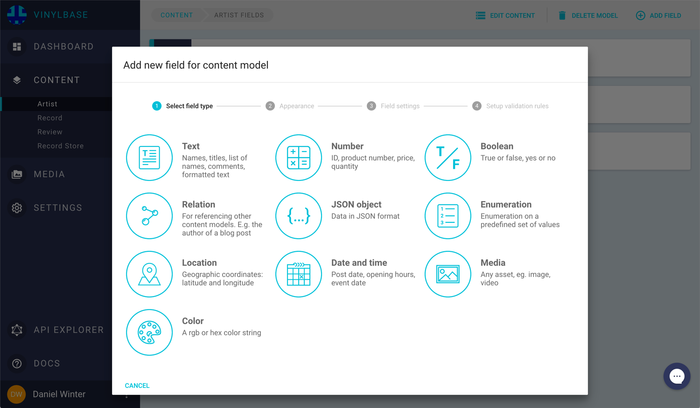

### Fields for model Artist

For content model `Artist`, we will add three fields:

* `Name`
* `Pictures`
* `Records`

For `Name` we use a `Single Line Text Field` that we set as `required`. The `Display Name` allows you define how the field will be displayed in the web interface, while the `API ID` defines how the field will be named in your content API.

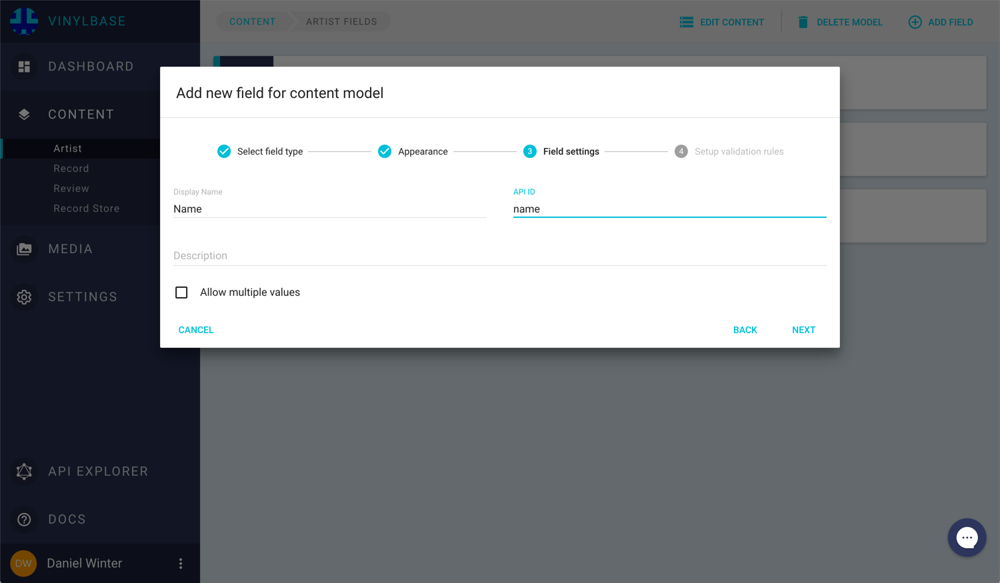

!!! Hint ""
    In the web interface, API IDs are prefixed with a `#` (e.g.: `#name`).

    API IDs for fields must start with a lowercase letter and can contain only alphanumeric characters.

For field `Pictures` we will add a media field and check `Allow multiple values`, this will allow us to store an arbitrary number of media files.

We will now add a relation to this model. Relations allow you to connect two content models. In this case, we create an `ArtistRecord Relation`, since we want to connect artists to existing records. The `Relation Name` defines how the relation will be named in your content API.

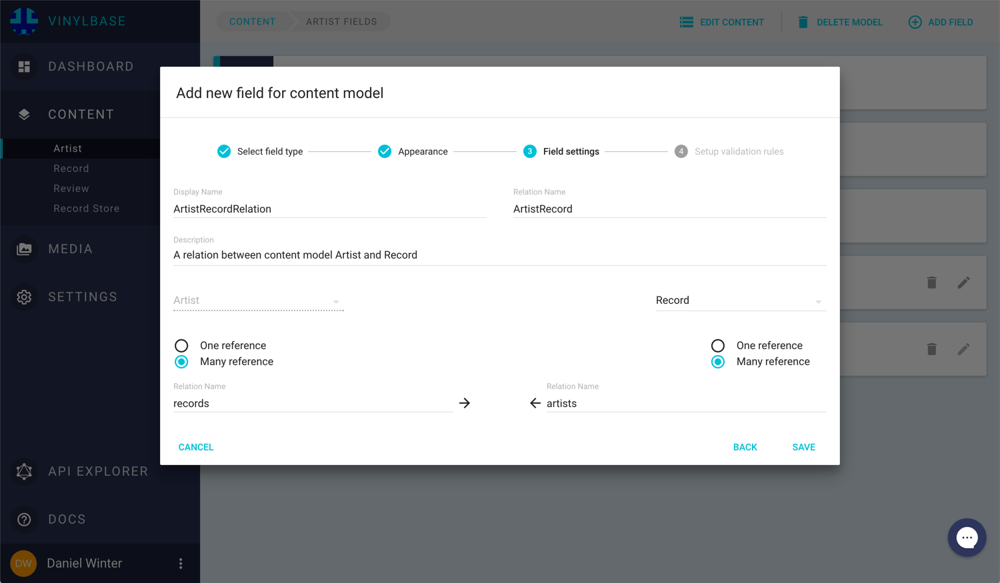

We will set up the relation so that an `Artist` can have _many_ `#records`, while on the reverse side, a `Record` can also have _many_ `#artists`.

!!! Hint ""
    Relation names must start with a capital letter and can contain only alphanumeric characters

You can now see all fields that are attached to model.

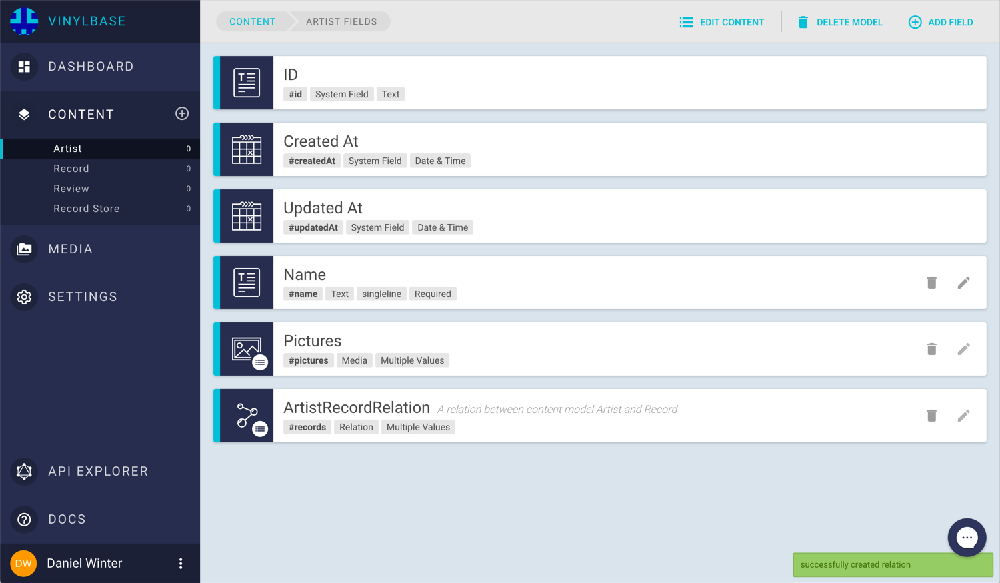

!!! Hint ""
    Notice that there are three additional fields: `ID`, `CreatedAt` and `UpdatedAt`. These are system fields and cannot be removed or modified.

!!! Hint ""
    You can change the order of your fields by dragging an entry on the icon on the left side.
    The order you define here is the same order within the entry form, where you can create or edit entries for this content model.


### Fields for model Record

This model will store content for music records. The fields will be:

* Title `#title` `Single Line Text` `required`
* Tracklist `#tracklist` `Single Line Text` `Allow multiple values`
* Cover `#cover` `Media`

Noticed the relation field with API ID `#artists` on this model? This field entry is here because it is the `reverse side` of the `ArtistRecord Relation` we created before. Since we are building a GraphQL content API, we need to be able to traverse in both directions.

### Fields for model Review

For content model `Review`, we add the following fields:

* Title `#title` `Single Line Text` `required`
* Record `#record` `One-to-Many Relation on model Record`. This will again add another reverse relation field on model `Record`, which we named `#reviews`
* Review `#review` `Markdown Text`

### Fields for model Record Store

The last content model that we are going to configure will store information about record stores and the records they have in stock.

Field configuration:

* Name `#name` `Single Line Text` `required`
* Location `#location` `Markdown Text`
* Articles `#articles` `Many-to-Many Relation on model Record`. This will again add another reverse relation field on model `Record`, which we named `#stores`.

Great! We can now start to create our content.

## Creating Content

 We will start by adding a `Content Entry` of type `Record`. We can do so by clicking on the small plus icon next to the model in the sidebar or by clicking the model and then clicking on the `NEW ENTRY` button.

### Creating a `record`

We are now able to use the input form elements to populate our content. The presentation of the input fields depend on the field configuration we did before.
For example, field `#cover` is of type `Media`, so it will allow you to upload media to your project and attach it to your record.

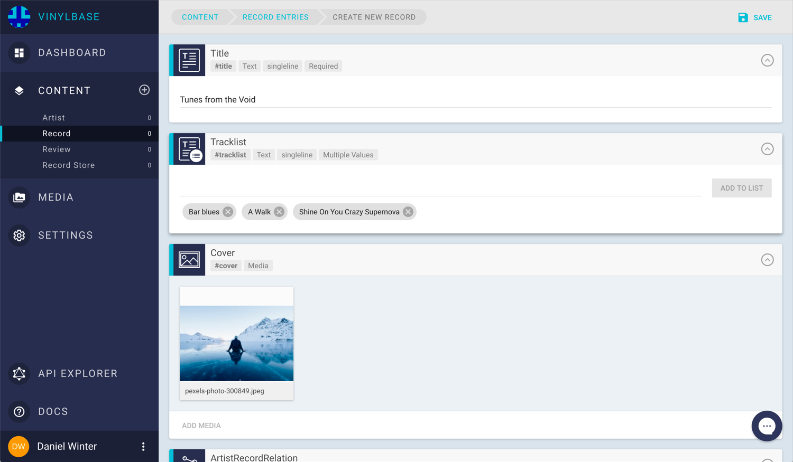

!!! Hint ""
    Before uploading, you can crop pictures within the upload widget.

    All uploaded files can be found in the `MEDIA` section.


We will leave the relation fields blank for now, since we don´t have any content entries that could be assigned.

We can save the entry now by clicking the `SAVE` button. This will take us to the overview of our `Record` content entries.

### Creating an `artist`

Now let us create a `Content Entry` of type `Artist`. We do this in the same way as we did with the `Record Entry`. Except this time we will be able to assign an entry to the relation field `#records`. Let´s assign the record we created previously!

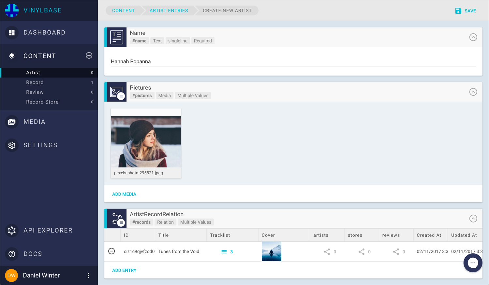

### Creating a `review`

Let us now add a review to _Hannah Popanna´s_ new record. Here we can use a markdown editor to write a sophisticated critique.

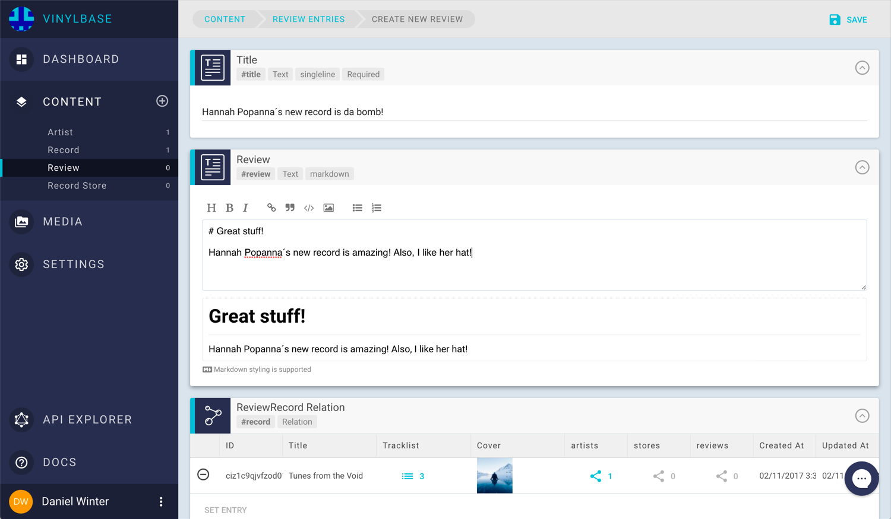

### Creating a `record store`

Almost done! In the last step, we create an entry for a `Record Store`. To add a location to it, we can use the maps widget.

Cool. Now that we are done with our content creation, let´s start to explore our GraphQL content API in the `API EXPLORER`

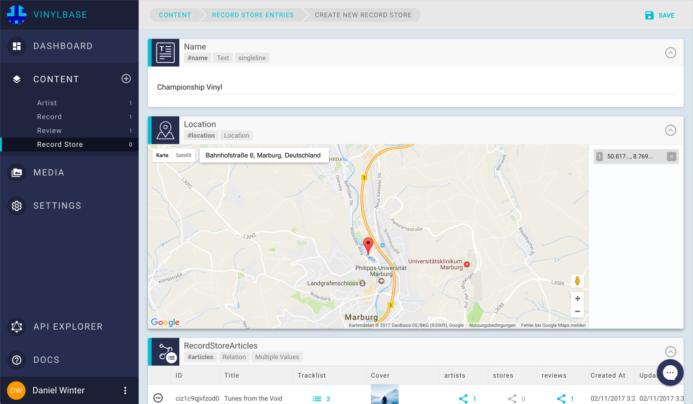

## Exploring the Content API

In the `API EXPLORER`, we can switch between the `simple` GraphQL endpoint and the `relay` endpoint. Both endpoints are serving our project´s content, but in different ways. For now, we will choose the `simple` endpoint.

We can start typing in a GraphQL query with the integrated GraphiQL editor. Let us send the following query to the server:

```
{
  allRecordStores {
    name
    location
    articles {
      title
      cover {
        fileName
        url
      }
      tracklist
      artists {
        name
        pictures {
          url
          size
        }
      }
      reviews {
        title
        review
      }
    }
  }
}
```

Will respond with:

``` JSON
{
  "data": {
    "allRecordStores": [
      {
        "name": "Championship Vinyl",
        "location": {
          "lat": 50.81655790000001,
          "lng": 8.76931209999998
        },
        "articles": [
          {
            "tracklist": [
              "Bar blues",
              "A Walk",
              "Shine On You Crazy Supernova"
            ],
            "cover": {
              "fileName": "pexels-photo-300849.jpeg",
              "url": "https://media.graphcms.com/2D1bXQZLTiGY6Uz8LUqB"
            },
            "artists": [
              {
                "name": "Hannah Popanna",
                "pictures": [
                  {
                    "url": "https://media.graphcms.com/kgxzNRIIQUanwoBugK5O",
                    "size": 3258909
                  }
                ]
              }
            ],
            "reviews": [
              {
                "title": "Hannah Popanna´s new record is da bomb!",
                "review": "# Great stuff!\n\nHannah Popanna´s new record is amazing! Also, I like her hat!"
              }
            ],
            "title": "Tunes from the Void"
          }
        ]
      }
    ]
  }
}
```

Cool! We can now start building our frontend application. Switch over to the `SETTINGS` menu to see your endpoint `URLs` and create `Permanent Auth Tokens` for your applications. [See how to work with permanent auth tokens](/guides/Using_permanent_auth_tokens).

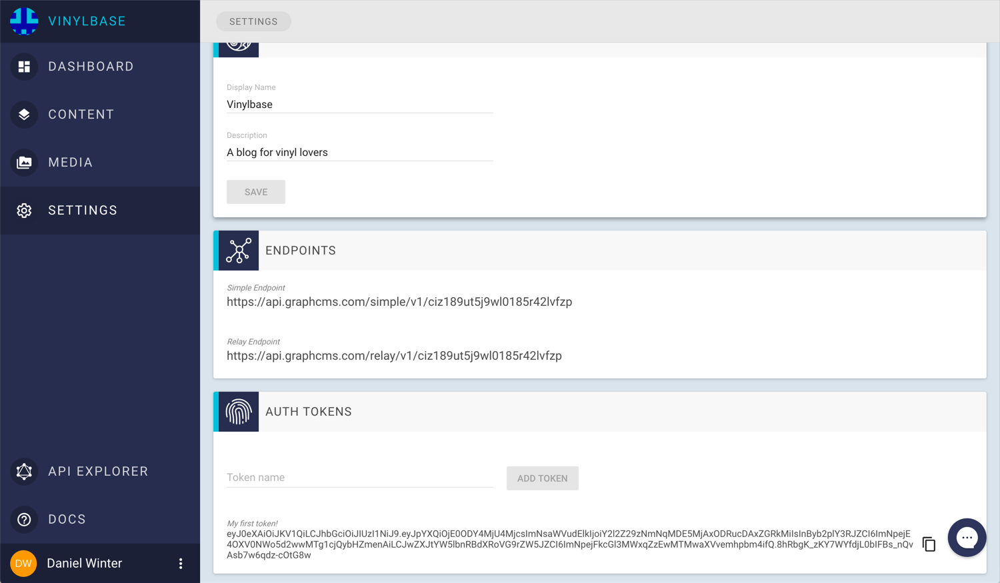

!!! warning ""
    GraphCMS is still in early preview. If you run into an issue, please have a look at the known issues in our [issue tracker](https://github.com/GraphCMS/Issue-tracker). Please don´t hesitate to open a bug ticket if you experienced an issue that is not covered by those in the tracker.

!!! hint ""
    In case you want to know more about the features we are currently working on, please check our public [roadmap](https://github.com/GraphCMS/Roadmap).  If you are missing a feature or if you have an idea for additional functionality, please help us to improve by submitting a feature request to this repository.
