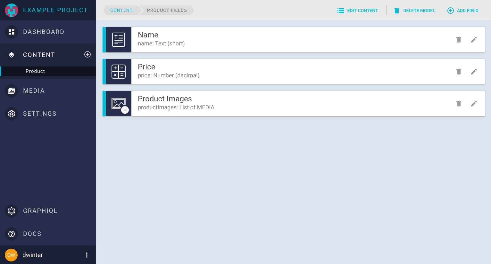
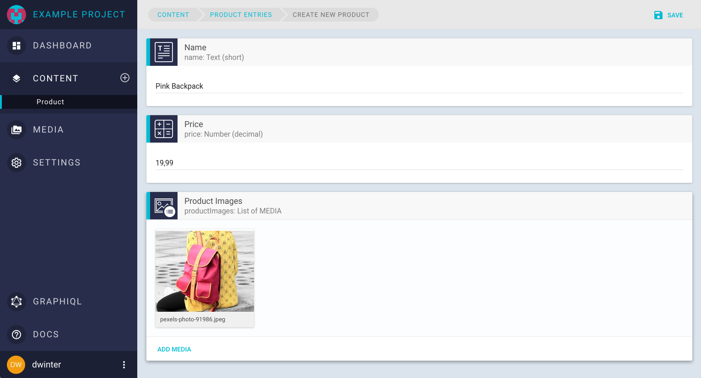

# Getting Started

## Projects

Your content lives within a project. In a project you can:

* Define the shape of your content by adding `content models`
* Add `fields` to your models
* Manage and browse your project´s content
* Upload and assign media files
* Invite others to your team
* Track the activity of your team
* Create permanent `auth tokens` for your applications and content consumers
* Use the integrated GraphiQL playground to run queries and mutations against your project´s endpoint

## Content Models

Content models describe the shape of your content. They consist of several fields while each field can store various types of content (e.g: text, numbers or images). A field can also be a reference to another model, which allows you to build a complex content graph. The fields you associate with a model will also define how its content onboarding user interface will look like.

Lets take a look on a small example. The following screenshot is showing the field configuration of a content model called **Product**.

It consists of three fields:

* **Name** of type *text*
* **Price** of type *Number*
* **Product Images** of type *Media*



After defining the fields, we are able to create *content entries* of type **Product**



One GraphQL query on this model would look like this:

```
query {
  allProducts {
    name
    price
    productImages {
      fileName
      size
      url
    }
  }
}
```

Which would result in the following response:

```
{
  "data": {
    "allProducts": [
      {
        "name": "Pink Backpack",
        "price": 19.99,
        "productImages": [
          {
            "fileName": "pexels-photo-91986.jpeg",
            "size": 712672,
            "url": "https://cdn.graphcms.com/api/file/Jk9MIsI2SzO9AqUbJraQ"
          }
        ]
      }
    ]
  }
}
```

## Fields

Fields are the building blocks of your content models.
GraphCMS offers the following field types:

* **Text:** names, titles, list of names, comments, formatted text...
* **Number:** ID, product number, price, quantity...
* **Boolean:** true or false, yes or no...
* **Date:** post date, opening hours, date of birth...
* **Media:** any asset, eg. image, video...
* **Enum:** selection on a predefined set of values
* **Location:** geographic coordinates: latitude and longitude
* **Relation:** for referencing other content models. E.g. the author of a blog post
* **Color:** rgba or hex color string
* **JSON:** data in JSON format
