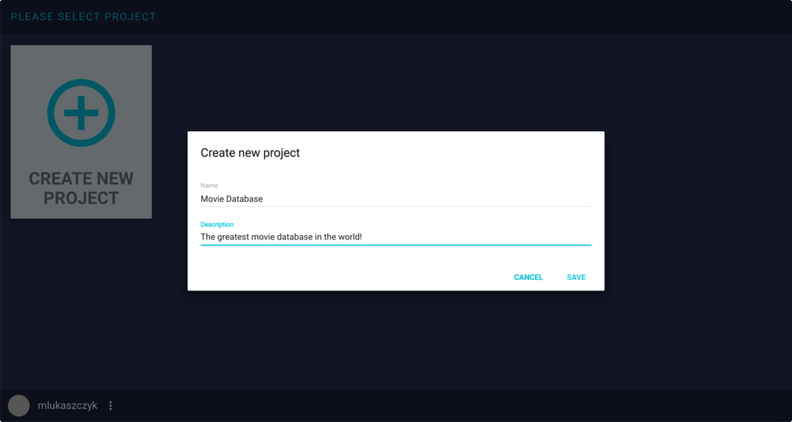
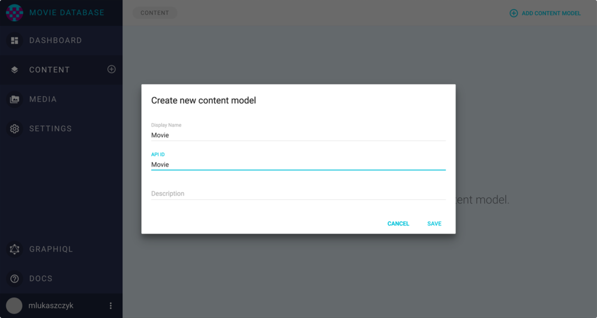
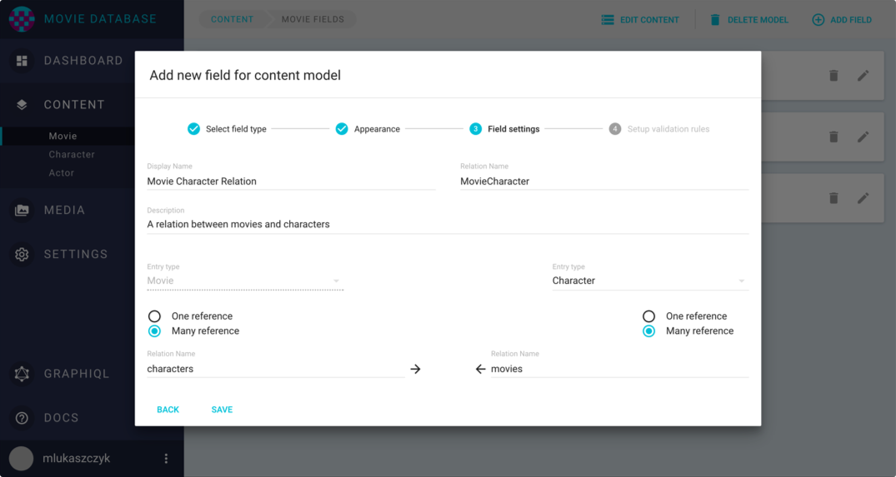
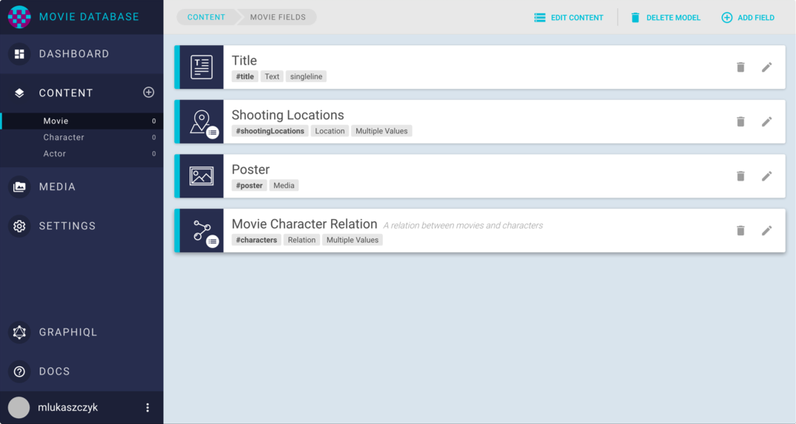
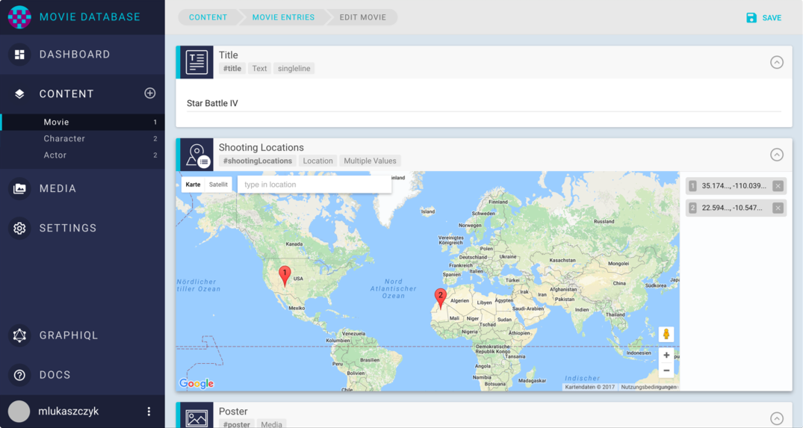
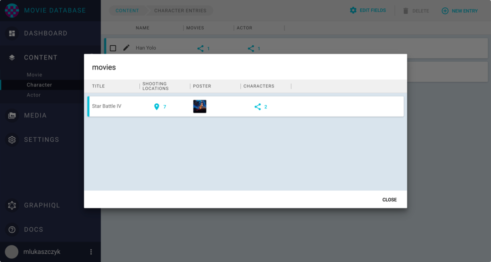
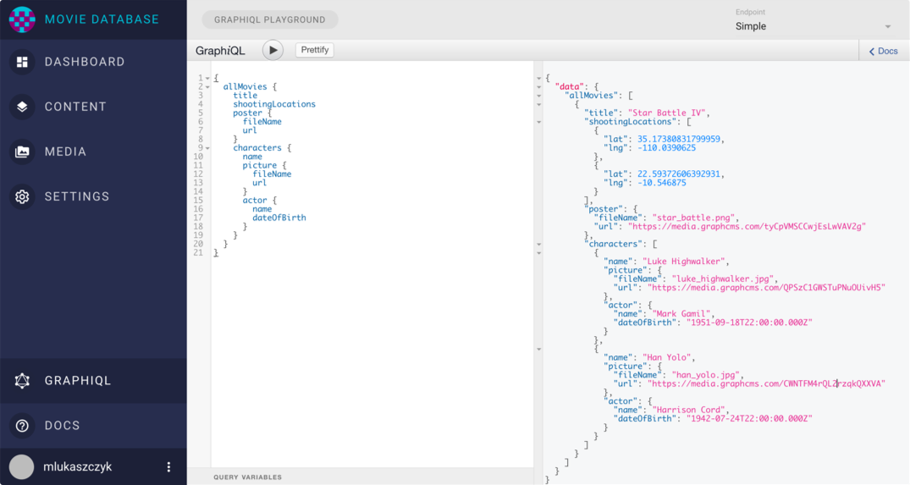

# Getting Started

Creating a content API with GraphCMS is easy. In this getting started guide we will create a `movie database` sample project.

After login screen see project overview page
- Click on project tile to open the project
- Switch to the content view
- Click on add content model
- Create three models: movie, character, actor
- switch to movie field list
- add text field, location field as list, media:poster, relation to Character
- add fields name + date of birth for actor and name and picture for character
- also add a relation between character and actor

















```
{
  allMovies {
    title
    shootingLocations
    poster {
      fileName
      url
    }
    characters {
      name
      picture {
        fileName
        url
      }
      actor {
        name
        dateOfBirth
      }
    }
  }
}
```


```
{
  "data": {
    "allMovies": [
      {
        "title": "Star Battle IV",
        "shootingLocations": [
          {
            "lat": 35.17380831799959,
            "lng": -110.0390625
          },
          {
            "lat": 22.59372606392931,
            "lng": -10.546875
          }
        ],
        "poster": {
          "fileName": "star_battle.png",
          "url": "https://media.graphcms.com/tyCpVMSCCwjEsLwVAV2g"
        },
        "characters": [
          {
            "name": "Luke Highwalker",
            "picture": {
              "fileName": "luke_highwalker.jpg",
              "url": "https://media.graphcms.com/QPSzC1GWSTuPNuOUivH5"
            },
            "actor": {
              "name": "Mark Gamil",
              "dateOfBirth": "1951-09-18T22:00:00.000Z"
            }
          },
          {
            "name": "Han Yolo",
            "picture": {
              "fileName": "han_yolo.jpg",
              "url": "https://media.graphcms.com/CWNTFM4rQL2rzqkQXXVA"
            },
            "actor": {
              "name": "Harrison Cord",
              "dateOfBirth": "1942-07-24T22:00:00.000Z"
            }
          }
        ]
      }
    ]
  }
}
```
