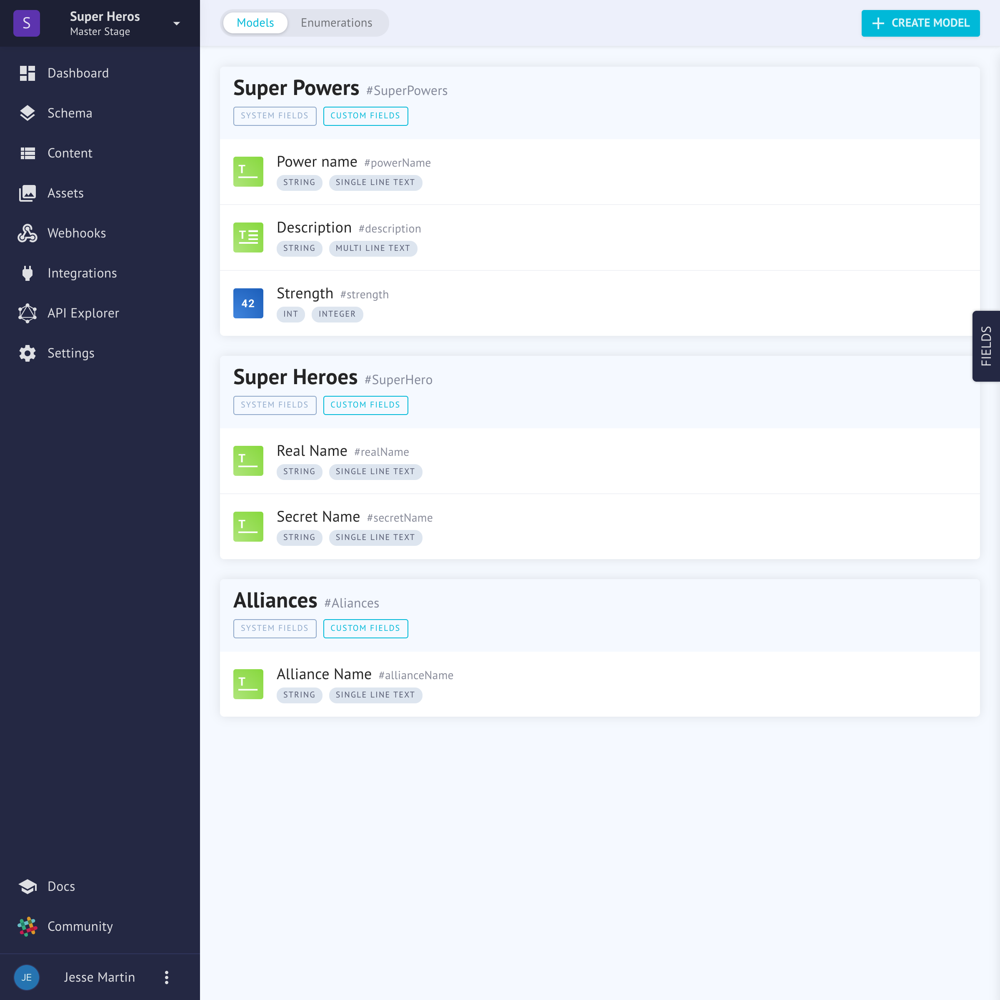

# Project API
Under the hood there are two API's at work. The Project API and the System API. The project API allows CRUD operations on your content _within_ a project. After a project is created, a unique api is generated just for the context of that project.

See the [System API](./management-api.md) docs here.

## Project API Shape
The Project API Shape is impossible to define. Each API changes depending on defined schema [models](../schemas.md#models), [enumerations](../schemas.md#enumerations) and user roles.

Let's take an example of this project's Content Management Interface (CMI).

The generated API for Super Heroes would look something like this:

### Arguments
| | |
| --- | --- |
| where | SuperHeroWhereInput |
| orderBy | SuperHeroOrderByInput |
| skip | Int |
| after | String |
| before | String |
| first | Int |
| last | Int |

### Fields

|  |  |
| --- | --- |
| id | ID! |
| createdAt | DateTime! |
| updatedAt | DateTime! |
| status | Status! |
| realName | String |
| secretName | String |

For making queries, [check out the API documentation.](the-api.md)