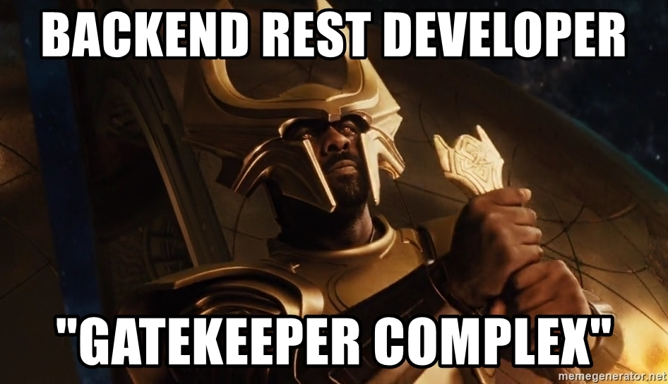

# We &hearts; Developers.
GraphCMS aims to be the most developer friendly CMS in existence. We do this by combining two powerful technologies that developers love.

First, we are the oldest (and we think best) CMS offering GraphQL as a first class citizen. That means you have a 100% available content model not dependent on an API gatekeeper.

Second, we offer a headless CMS. We free the presentation layer from the content layer which allows you to choose whichever stack you are most comfortable with and testing out new ideas is as simple as white-listing a new url.

Not familiar with GraphQL? It's ok, you're not lost. Just new here. [Checkout the magical world of GraphQL here.](https://graphql.org/learn/)

Not familiar with headless either? That's ok, see our [Headless Paradigms](../getting-started/headless-paradigms.md) article.

## But wait, there's more
Because we use GraphQL, we have access to the [amazing tools and resources for GraphQL](../graphql-tools-resources.md). If you don't know about it already, introspection will be your new favorite word. Seriously, all the cool kids are saying it.

What this Scrabble worthy word offers is the ability to explore the auto generated project API without having to fire off 404-doomed requests. Did the writers get too much power in defining their own models? No worries, explore the model with top level tooling and a built in API explorer.

<!-- TODO: Api Explorer -->

But don't take our word for it, explore the docs to find out all the hidden goodies the world's most developer friendly CMS has to offer.