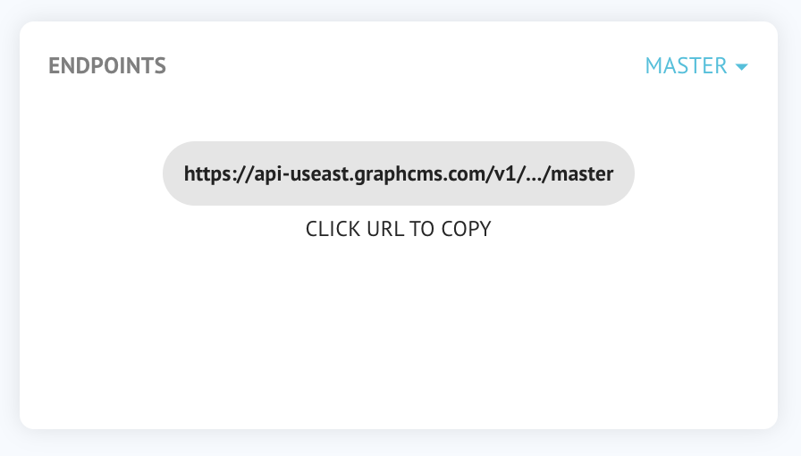

# Using Aliases for your API


This feature is planned but not yet implemented in the new beta. Stay tuned!


GraphCMS creates an API for your content. You can access the endpoint by using the following URL:

`https://api-$REGION.graphcms.com/v1/$PROJECTID/$STAGE`

To find your URL, go to the `Dashboard` view in GraphCMS and take a look at the `Endpoint` section (see the screenshot below):

You can replace the `projectId` in the URL with your own `alias`. If you set up an alias, i.e. `graphcmsalias` this will change your URL like this:

`https://api-$REGION.graphcms.com/v1/graphcmsalias/$STAGE`

<!-- TODO: Add Screenshot when added to app -->


Please remember that project aliases must be _globally_ unique. If another user has taken the alias already, you cannot use it in your project.



If you set up an alias for your project, you can still use the default URLs of your API.

