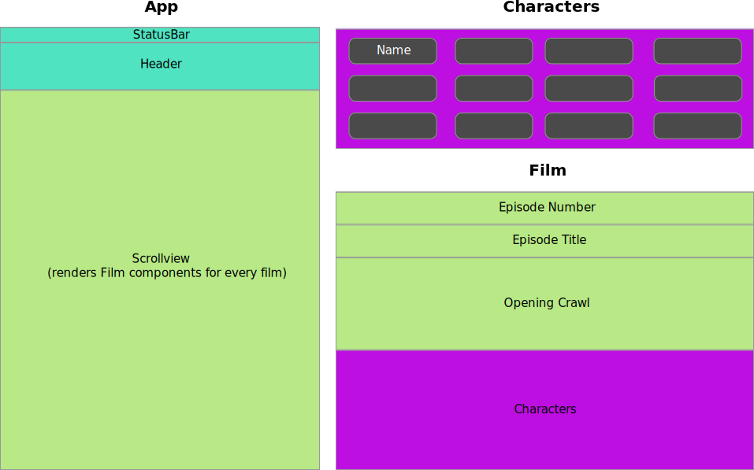
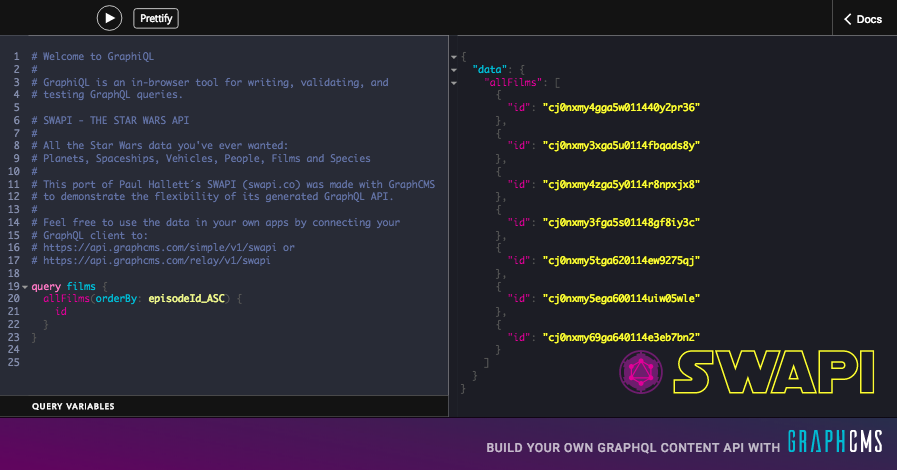

# Star Wars Expo App with Apollo and GraphCMS
<script async src="https://snack.expo.io/embed.js"></script>

🚀 **[Checkout the full code](https://snack.expo.io/r17Xs7yl-)**

In this example we are going to build a simple React Native Application backed by GraphCMS using [Snack by Expo.io](https://snack.expo.io) and [GraphCMS](https://graphcms.com). You can find the code on [Snack](https://snack.expo.io/r17Xs7yl-) or in the example´s [GitHub repository (Using create-react-native-app)]().

> *Easily build apps with React Native*
>
> Expo lets web developers build truly native apps that work across both iOS and Android by writing them once in just JavaScript. It's open source, free and uses React Native.
>
> From [Expo.io](https://expo.io)

The app will show simple information about the Star Wars movies using the SWAPI introduced on our [Blog](https://graphcms.com/blog/the-star-wars-api-just-got-a-makeover).

We divide the App in three main Components:

1. The `App` is responsible for rendering the `Statusbar`, `Header` and `Scrollview` as well as getting the data.
2. The `Film` Component, which renders a single Film.
3. And the `Characters` component maps over the characters to show all related characters.

The figure below shows the three components in action:



## GraphCMS-SWAPI

!!! hint ""
    If you haven´t set up a content model yet, please check our [Getting Started Guide](../Getting_Started). This project will focus on getting the content from GraphCMS and will be using the existing [GraphCMS-SWAPI](https://api.graphcms.com/simple/v1/swapi).

First lets head to [GraphCMS-SWAPI](https://api.graphcms.com/simple/v1/swapi) and use the API Explorer to build our `films` query.



We start by getting all films with the ids only. We will update our query as we build out the app.

```
query films {
  allFilms(orderBy: episodeId_ASC) {
    id
  }
}
```

## Application shell and data fetching

<div data-snack-id="S1Xg47yxZ" class="expo" data-snack-platform="ios" data-snack-preview="false"></div>

!!! hint ""
    Ignore the warnings about `unused components` for now. We will need them later and they only provide some styling. You can look into [Styled-Components](https://styled-components.com) if you are interested.

The App-Component is responsible for fetching the Data. We will use a simple `fetch` with `es6` promises to get the data we need from the Graphql-endpoint. If we wanted to we could just as easily use Apollo or Relay but lets keep it simple for now.

To hold the fetched data we need to introduce `state`:

```
export default class App extends Component {
  state = {
    data: null,
  };
  render() {
    return (...)
  }
}
```

Next we add the `componentDidMount` life cycle hook to fetch-data as soon as the App component is mounted. We use the new browser fetch, which comes with React-Native out of the box. The GraphCMS endpoint uses the standard `POST` Method. The body holds the `query` and `variables`. When the data comes back we simple use the components state to save it.
We simply copy-paste our query from API Explorer into a string.

```
componentDidMount() {
  const query = `
    query films {
      allFilms(orderBy: episodeId_ASC) {
        id
      }
    }
  `
  
  fetch('https://api.graphcms.com/simple/v1/swapi', {
    method: 'POST',
    headers: new Headers({
      'content-type': 'application/json',
    }),
    body: JSON.stringify({
      query,
      variables: null,
    }),
  })
  .then((res) => res.json())
  .then((json) => {
    this.setState({
      data: json.data,
    });
  })
}
```
<div data-snack-id="BkBT0V1x-" class="expo" data-snack-platform="ios" data-snack-preview="false"></div>

## The Film Component

In this section we will create the `Film` Component, add it to the App and add some more fields to our query.

First we go back to the [API Explorer](https://api.graphcms.com/simple/v1/swapi) to compose the new query and decide what data we need:

```
query films {
  allFilms(orderBy: episodeId_ASC) {
    id
    
    episodeId
    title
    openingCrawl
    
  }
}
```

Now we can model the component after the data we have.

```
const Film = ({ episodeId, title, openingCrawl }) => (
  <FilmContainer>
    <Title>Episode {episodeId}</Title>
    <Subtitle>{title}</Subtitle>
    <Content>
      <Crawl>{openingCrawl}</Crawl>
    </Content>
  </FilmContainer>
);
```

The data and component we need is now present and we need to map over the `allFilms` array and pipe the data into the `Film` Component. 

```
{this.state.data
  ? this.state.data.allFilms.map(film => (
      <Film key={film.id} {...film} />
    ))
  : <Loading />}
```

!!! hint ""
    Note: We only render the films if data is present, otherwise we just render a spinner.

<div data-snack-id="r1oi7XkeZ" class="expo" data-snack-platform="ios" data-snack-preview="false"></div>

## The Characters Component

Now lets improve our app by adding the characters for each film.

We follow the same strategy as before.

  1. Define components purpose
  2. Checkout data needs in API Explorer and compose query
  3. Build component 
  4. Add component to existing tree and provide data

> The Characters component should render all provided characters.

We need to add the characters with their id and name to the query:

```
characters {
  id
  name
}
```

Create the component itself:

```
const Characters = ({ characters }) => (
  <Info>
    <InfoTitle>Characters:</InfoTitle>
    <Row>
      {characters.map(({ name, id }) => (
        <Character key={id}><Text light>{name}</Text></Character>
      ))}
    </Row>
  </Info>
);
```

Update the `Film` Component with the updated Content:

```
const Film = ({ episodeId, title, openingCrawl, characters }) => (
  <FilmContainer>
    <Title>Episode {episodeId}</Title>
    <Subtitle>{title}</Subtitle>
    <Content>
      <Crawl>{openingCrawl}</Crawl>
      <Characters characters={characters} />
    </Content>
  </FilmContainer>
);
```

The simple app we wanted to build today is finished, but you can take it in whatever direction you would like from here, just by following the pattern we developed above.

<div data-snack-id="r17Xs7yl-" class="expo" data-snack-platform="ios" data-snack-preview="false"></div>

