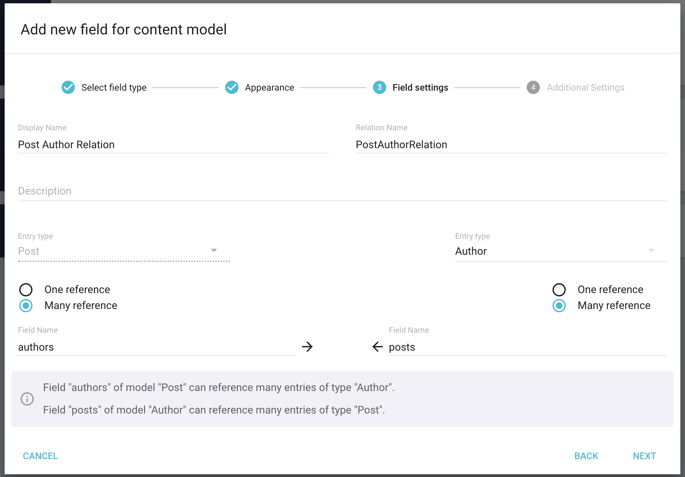
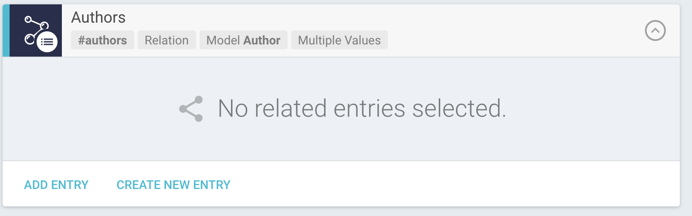
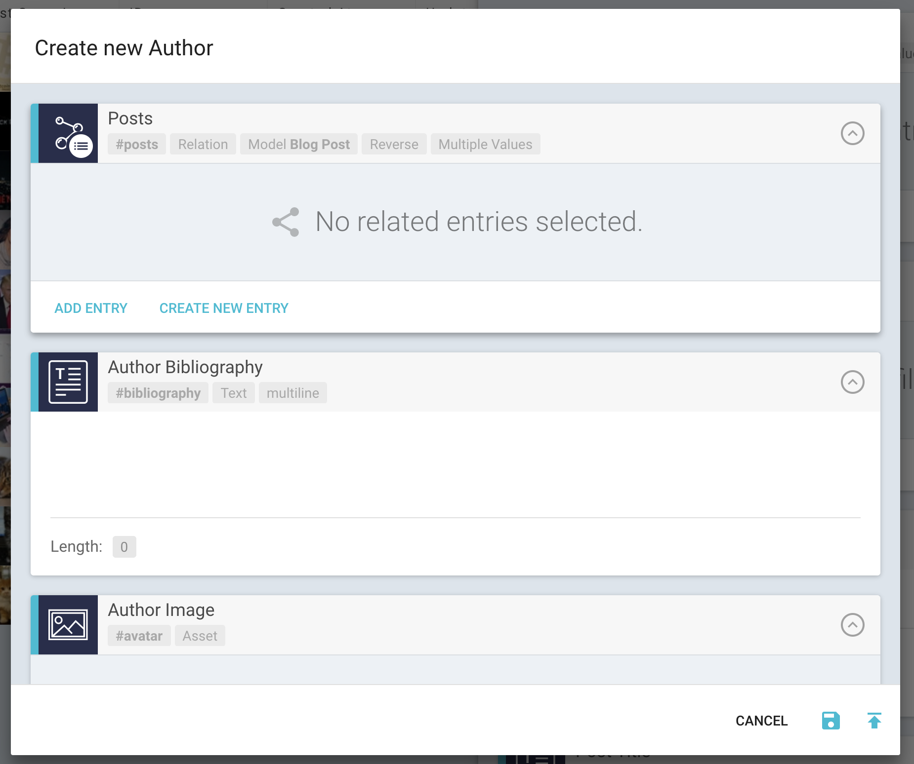

# Setting up the Blog Example Project

In order to make use of our different skeleton examples we need to create a projects that has a specific model structure. In this guide we go through creating said example project and how to fill it with your own content.

## Getting started

To start your Blog Example you have two choices of going forward:

1. Creating a project from scratch

2. Using the Blog Template

### Starting from scratch

The first step in our journey for an awesome blog model structure is the project creation. Navigate to your [project overview](https://app.graphcms.com/overview) and click on `Create Project`. Choose a fitting name and description and select your desired region. Hit `Next` and choose `From Scratch`.

That was easy, wasn't it? The actual model creation won't get any more difficult, we promise! 🤓

### Using the Blog Template

If you don't want to go through all the content model creation steps you can also choose `From Template` instead of `From Scratch` and choose `Blog Template`. Skip to [Creating Content](#creating-content) to continue the guide now.

## Creating the Content Models

To create the needed content models you can now click on your freshly born project and get to your project dashboard. Select `Models` in the left hand navigation - this is where it gets interesting. In order to use the example project we need to have a fixed structure for our models.

Our Blog will consist of two main Models:

- `Post`: Here we will have all the field related to our posts such as title, content, image and much more.
- `Author`: This will be a collection of fields describing the Author (name, image, bibliography)

Doesn't sound complicated at all, doesn't it? Let's get started!

### Post Model

First we will take care of the Blog `Post` Model. Click `Add Content Model` on the top right. Enter `Post` as display name, the API ID will be field in automatically. The display name will be the model name shown in GraphCMS, while the API ID is the name shown via the GraphQL API. If you want to you can set a description and hit `Save`.

After the Model is created we can get to the fields. We will go through the creation of some fields together and have you create the rest.

Let's start with our Post `Title`: Hit `Add Field` right under your model and select the type `Text`. Since our title is not really long we will choose `Single Line`. Now we enter `Title` as Display Name - the API ID will be filled in automatically again. There's no other configuration we need to do so we just hit `Next` two times.

Next up we will create our Post `Slug` field, which we will use for the URL in the detail view. Hit `Add Field` again and choose `Text`. Now make use of the `Slug` appearance. Enter `Slug` as Display name (API ID gets filled in) and select `Field value is unique`. That's all for configuration, so hit `Next` and then `Save` to finish the creation.

Now you need to create to following fields to finish up the `Post` Model:

- `Content` field – Type `Text` – Appearance `Rich Text`
- `Cover Image` field – Type `Asset` – Appearance `Asset Grid`
- `Date and Time` field – Type `Date and Time` – Appearance `Date & Time``
- `Tags` field – Type `Text` – Appearance `Slug` – Configuration: `Field has multiple values`

### Author Model

One of our last steps is the `Author` Model. Just like before click `Add Content Model` on the top right and enter `Author` as Display Name and hit `Save`.

Now we will add the necessary fields:

- `Name` field – Type `Text` – Appearance `Single Line`
- `Image` field – Type `Asset` – Appearance `Asset Grid`
- `Bibliography` field – Type `Text` – Appearance `Multi Line`

Now we are nearly done with our Content Model, and we just need one more step to connect a `Blog Post` with an `Author`.

### Relations

To set up a Relation from our Post Model to the Author Model we need to create a `Relation` field. The general approach to create relations is top-down. So you would create the Relation from the Model that is "above" the other. In this case `Post` would be our top level model and Author beneath it.

So we will click `Add Field` on the `Post` Model and select `Relation` and `Content Entry Table` in the next step. As Display Name we enter `Post Author Relation`

Now your need to select the `Entry type` the left one is already selected from the `Post` Model. For the right one choose `Author`. We want to have a Many-to-Many relation since a Post can have many Authors and the other way around, so click `Many reference` on both sides. The field names should automatically be filles with `authors` on the `Post` side and `posts` on the `Author` side. Hit `Next` and `Save` to finish the relation.

Now we are all set to create content for our Posts! 🔥

## Creating Content

In order to have a good source of content for the demo applications, we want to create at least 5 content entries. You can decide yourself what they should be 😊

To create some posts, click on `Post` under `Content` in the left navigation. Click on the `+` symbol on the top right to start the creation.

Fill in all the Fields you need for a Post. The `Authors` field is the Relation we just created. You can click `Create new entry` there to start inline creation of an `Author`.

After you created an `Author` you can also select existing ones by clicking `Add Entry`. To finish the creation of one post, click `Save and Publish` in the top right corner.

Repeat these step until you have a few posts ready.

When you are done with the content creation you are ready to jump into the example! Never stop the grind 💯 💪 🏈

## Choose your Example

You can now choose between the React and Vue example to continue your journey!