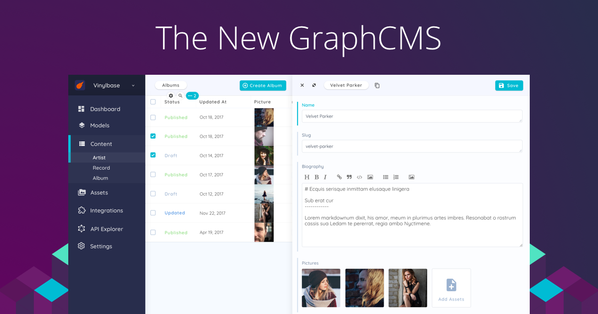
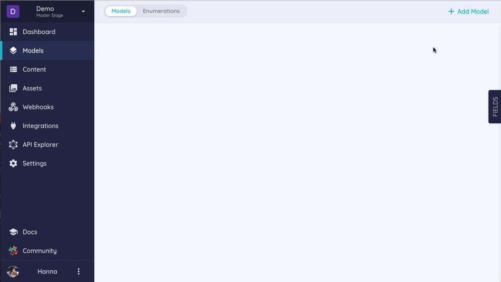

ogtitle: GraphCMS Beta Onboarding
ogdescription: Detailed GraphCMS Beta Onboarding Docs
ogimage: https://graphcms.com/blog/covers/new_gcms_cover.png

# 🎉 The New GraphCMS - Beta Onboarding 🎉

Welcome to the beta of the new GraphCMS! We are very happy to have you as one of our early stage testers.



##General Information
The current state of the revamped web app is having a limited feature set and is not on par with the existing application. However, the ground work is done and we will now be able to ship new features at a very fast pace. 
The current beta web app is capable of the following things:

- Creating a Project
- Creating Models
- Adding Fields:  
    - Single Line Text
    - Multi Line Text
    - Markdown
    - Code
    - Integer
    - Float
    - Checkbox
- Creating Content
- Uploading Assets
- Staging Preview
- API Explorer (API per Stages)

!!! warning
    The performance of the beta is not on par with the production version since we are using minimal hardware ressources for testing purposes. The final version will have a highly increased performance.

    There might also be data-loss from time to time if we need to reset the database for new features or restructuring. Please note that the beta is not recommended to use in Production at the moment!

## How to Give Feedback
During the beta we are dependent on your feedback! There may be things that are not working properly or some rough edges, but we still want you to provide us with everything that you find buggy or weird. If you are missing something or got stuck somewhere, just let us know!

You can reach us via [Slack](https://slack.graphcms.com) in the locked `#beta` channel. If you need access for that simply message `@fabian` in Slack or [fabian@graphcms.com](mailto:fabian@graphcms.com).

## How to Access
The Beta version is hosted on [https://beta.graphcms.com](https://beta.graphcms.com) and we will whitelist your email for access! 

!!! warning
    You will need to use `Sign up` and **create a new account with the email that received the invite**, since the accounts are not linked to the old version.
If you have trouble logging in, please contact us in Slack.

## Field Creation Workflow

To create fields you can make use of our brand new workflow for that. Simply create a Model and drag the Fields onto it:



## Staging Preview

The new GraphCMS is allowing you to create `Stages` for your project. The most bottom stage will be the `Read-And-Write` Stage. All other Stages are `Read-Only`. So changes can only be applied on the bottom stage and then synced upwards.

See a quick demo  here:


## API Changes

The API will be a little different from what you are used in the current version. The `all`-Prefix from the queries is gone now. So a simple Query might look like this:
```json
query {
    posts {
        id
        title
        content
    }
}
```

### Filtering
If you want to filter you now need to use the `where` argument:
```json
query {
  authors(where: {
    age_gt: 18
  }) {
    id
    name
  }
}
```

A more advanced filter example:
```json
query {
  posts(where: {
    title_in: ["My biggest Adventure", "My latest Hobbies"]
  }) {
    id
    title
    published
  }
}
```

As before you can also use `AND` and `OR` to chain filters:
```json
query {
  posts(where: {
    AND: [{
      title_in: ["My biggest Adventure", "My latest Hobbies"]
    }, {
      published: true
    }]
  }) {
    id
    title
    published
  }
}
```

### Ordering
Ordering still works the same as before:
```json
query {
  posts(orderBy: title_ASC) {
    id
    title
    published
  }
}
```

### Pagination
You can accomplish Pagination like this for example:
```json
query {
  posts(
    first: 2
    skip: 1
  ) {
    id
    title
  }
}
```

```json
query {
  posts(
    first: 2
    after: "cixnen24p33lo0143bexvr52n"
  ) {
    id
    title
  }
}
```

### Mutations

Mutations are looking a little bit different now. Here are the main changes:

#### Creating Nodes

The create Mutation now takes a `data` argument, which includes an object of the fields you want to create:

```json
# Create a new Author
mutation {
  createAuthor(
    data: {
      age: 42
      email: "zeus@example.com"
      name: "Zeus"
    }
  ) {
    id
    name
  }
}
```

#### Updating Nodes

The update Mutation also takes a `data` argument but also `where` for filtering for the specific node that should be updated:

```json
# Update an Author
mutation {
  updateAuthor(
    data: {
      email: "zeus2@example.com"
      name: "Zeus2"
    }
    where: {
      email: "zeus@example.com"
    }
  ) {
    id
    name
  }
}
```

#### Upserting

When we want to either update an existing node, or create a new one in a single mutation, we can use _upsert_ mutations.

Here, we use `upsertAuthor` to update the `Author` with a certain `email`, or create a new `Author` if a `Author` with that `email` doesn't exist yet:

```json
# Upsert a Author
mutation {
  upsertAuthor(
    where: {
      email: "zeus@example.com"
    }
    create: {
      email: "zeus@example.com"
      age: 42
      name: "Zeus"
    }
    update: {
      name: "Another Zeus"
    }
  ) {
    name
  }
}
```

#### Deleting Nodes

```json
# Delete an Author
mutation {
  deleteAuthor(where: {
    id: "cjcdi63l20adx0146vg20j1ck"
  }) {
    id
    name
    email
  }
}
```

## What to Expect in the Next Weeks
We will be making daily changes to the web app and the web app will display when a new version is ready.

The final release around the end of may will be mostly feature pair with the "old version" of GraphCMS, so there will be a lot of things coming throughout the beta. 

What's still to come:

- Dashboard (without Mock data)
- Translations
- Staging
- Webhooks
- Publish Workflows
- Remaining Fields
- Relations
- Roles
- Integrations (Algolia etc.)
- Settings
