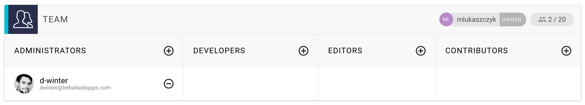

# Adding members to your team

You can add other GraphCMS users as team members to your projects. This can be done from the _Team_ panel in the _Settings_ view, which also shows all members of your project.

By default, this table is empty and only the project owner is displayed in the header of the panel.
You can invite other GraphCMS users to your project and assign them a role. Currently, there are four predefined roles:

* Admin
* Developer
* Editor
* Contributor

Depending on the role, the user has access to different parts of the CMS. The table below shows all the actions which depend on the users role within a project.

|Action | OWNER | ADMIN | DEVELOPER | EDITOR | CONTRIBUTOR |
| -------- | ------- | ------------- | ------- | -------- |
| Write Content | ✔ | ✔  | ✔ | ✔ | ✔ | ✔ |
| Edit Content Model | ✔ | ✔ | ✔ | 𐄂 | 𐄂 | 𐄂 |
| Configure Webhooks | ✔ | ✔  | ✔ | 𐄂 | 𐄂 | 𐄂 |
| Manage Team Members | ✔ | ✔ | 𐄂 | 𐄂 | 𐄂 | 𐄂 |
| Change Project Config | ✔ | ✔ | 𐄂 | 𐄂 | 𐄂 | 𐄂 |
| Manage Auth Tokens | ✔ | ✔ | ✔ | 𐄂 | 𐄂 | 𐄂 |
| Change API Access Settings | ✔ | ✔ | ✔ | 𐄂 | 𐄂 | 𐄂 |
| Export Schema and Data | ✔ | ✔ | ✔ | 𐄂 | 𐄂 | 𐄂 |
| Delete Project Data | ✔ | ✔ | 𐄂 | 𐄂 | 𐄂 | 𐄂 |
| Delete Project | ✔ | 𐄂 | 𐄂 | 𐄂 | 𐄂 | 𐄂 |

Depending on the role, the user has access to different parts of GraphCMS. The table below shows all the actions which depend on the users role within a project.

|Action | OWNER | ADMIN | DEVELOPER | EDITOR | CONTRIBUTOR |
| -------- | ------- | -- | ------- | --- | --- |
| webhooks | ✔ | ✔  | ✔ | 𐄂 | 𐄂 | 𐄂 |
| delete project | ✔ | 𐄂 | 𐄂 | 𐄂 | 𐄂 | 𐄂 |
| delete project data | ✔ | ✔ | 𐄂 | 𐄂 | 𐄂 | 𐄂 |
| manage members | ✔ | ✔ | 𐄂 | 𐄂 | 𐄂 | 𐄂 |
| change project config | ✔ | ✔ | 𐄂 | 𐄂 | 𐄂 | 𐄂 |
| manage authTokens | ✔ | ✔ | ✔ | 𐄂 | 𐄂 | 𐄂 |
| CRUD model | ✔ | ✔ | ✔ | 𐄂 | 𐄂 | 𐄂 |
| change API settings | ✔ | ✔ | ✔ | 𐄂 | 𐄂 | 𐄂 |
| export data | ✔ | ✔ | ✔ | 𐄂 | 𐄂 | 𐄂 |

You can search for users by their email address. Click on the `plus` icon beside the role name and type in the emails address.
If there exist multiple users for this email address, e.g. if they have signup with different social providers, you see a list of search results. Otherwise you see exactly one search result. By clicking the `ADD` button, the user will be added to the project and notified via an email.

!!! hint ""
    Each user can be assigned to one role at a time. If you want to change the role, simply remove this user and send a new invitation.

!!! hint ""
    To remove yourself from a project, use the `LEAVE PROJECT` button in the danger zone.
