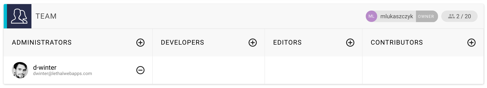

# Adding people to your project

You can add other GraphCMS users as team members to your projects. This can be done in the _Settings_ view. There you find a panel _Team_ which shows all current members of your project.

By default this table is empty and only the project owner is displayed above.
To add other members you first have to choose their role within your project. Currently there are four predefined roles for a user:

* Admin
* Developer
* Editor
* Collaborator

Depending on the role, the user has access to different parts of GraphCMS. The table below shows all the actions which depend on the users role within a project.

|Action | OWNER | ADMIN | DEVELOPER | EDITOR | CONTRIBUTOR |
| -------- | ------- | -- | ------- | --- | --- |
| webhooks | ✔ | ✔  | ✔ | 𐄂 | 𐄂 | 𐄂 |
| delete project | ✔ | 𐄂 | 𐄂 | 𐄂 | 𐄂 | 𐄂 |
| delete project data | ✔ | ✔ | 𐄂 | 𐄂 | 𐄂 | 𐄂 |
| manage members | ✔ | ✔ | 𐄂 | 𐄂 | 𐄂 | 𐄂 |
| change project config | ✔ | ✔ | 𐄂 | 𐄂 | 𐄂 | 𐄂 |
| manage authTokens | ✔ | ✔ | ✔ | 𐄂 | 𐄂 | 𐄂 |
| CRUD model | ✔ | ✔ | ✔ | 𐄂 | 𐄂 | 𐄂 |
| change API settings | ✔ | ✔ | ✔ | 𐄂 | 𐄂 | 𐄂 |
| export data | ✔ | ✔ | ✔ | 𐄂 | 𐄂 | 𐄂 |

You can search for users by their email address. Click on the `plus` icon beside the role name and type in the emails address.
If there exist multiple users for this email address, e.g. if they have signup with different social providers, you see a list of search results. Otherwise you see exactly one search result. By clicking the `ADD` button, the user will be added to the project and notified via an email.

!!! hint ""
    Each user can be assigned to one role at a time. If you want to change the role, simply remove this user and send a new invitation.
