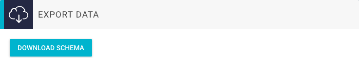

# Export your Schema and Content


## Export Schema

To export the GraphQL schema of your GraphCMS project, you can use the export function from the _Settings_ page.



This will automatically download a `schema.txt` file, containing all schema information of your current content API.

An example schema is shown below. It shows the schema for three content models: `Article`, `Author` and `Asset`.

Asset is a system model created by GraphCMS.
The content model `Article` has one custom field `title` of type `String`. The content model `Author` has also one custom field with name `name` and type `String`.
Both models are connected via a one-to-many relation with name `AuthorArticles`.

```json
type Article {
  author: Author @relation(name: "AuthorArticles")
  createdAt: DateTime!
  id: ID!
  title: String
  updatedAt: DateTime!
}

type Author {
  articles: [Article!]! @relation(name: "AuthorArticles")
  createdAt: DateTime!
  id: ID!
  name: String
  updatedAt: DateTime!
}

type Asset {
  createdAt: DateTime!
  fileName: String!
  handle: String!
  id: ID!
  isPublic: Boolean
  mimeType: String
  size: Int!
  updatedAt: DateTime!
  url: String!
}
```
## Export Content

To download your complete content, you will need to create query that includes every model and field of your project. Run the query against your projects API via the API Explorer for example.

Here's an example for the Schema mentioned above:

```json
query backup {
  article: allArticles {
    id
    title
    author{
      id
      name
    }
  }
  author: allAuthors {
    id
    name
    articles {
      id
      title
    }
  }
  asset: allAssets {
    id
    filename
    handle
    mimeType
    size
    url
  }
}
```

The response of this query will be in a `JSON` format.

!!! warning
    Make sure to also download the assets that are stored in GraphCMS manually, since they will be deleted once you delete your project!
