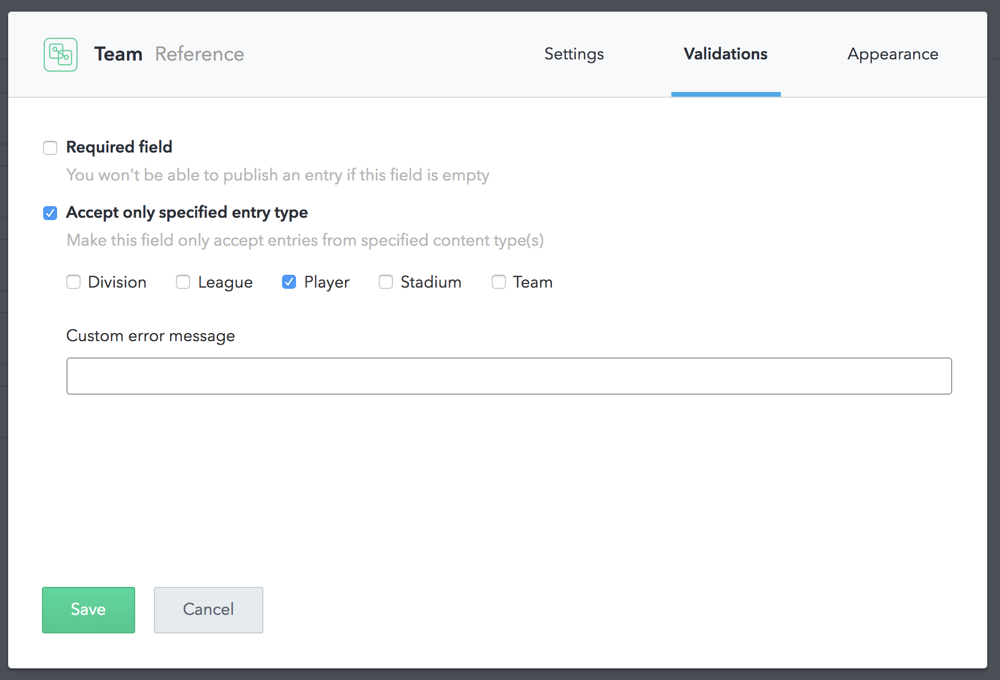

# Import Contentful Projects

!!! danger " "
        Please note that the importer is still in **BETA**.  
        Report any bugs via On-Site-Chat, [Slack](https://slack.graphcms.com) or in our [Issue-Tracker](https://github.com/GraphCMS/Issue-tracker)

In this guide we will go through the importing process of a Contentful project into GraphCMS.

## The Importing Process

To import a contentful project you first need to create a new project in GraphCMS. You specify a name, description and choose your desired region. After you click next, you will be able to choose `Import from other CMS`. Select the card and click next. Now you select `Contentful` and click next again.

You are now prompted for your Contentful project tokens: `Space ID`, `Content Delivery Token` and `Content Management Token`. You can find these in Contentfuls Navigation bar under `APIs`. 

After entering the credentials you can continue to the next step.

## Fixing your Models, Fields and Relations

!!! danger " "
        Relations in Contentful work a little different from the ones in GraphCMS. You will get an error when importing a project with relation fields, which didn't specify a discrete entry type.

After successfully entering all you necessary tokens and clicking `Next` you will most likely be presented with some issues, when having relations in Contentful. This issue is probably occurring since you have relation fields and didn't specify a discrete entry type:

You need to set these manually for every relation you have. Afterwards you should be able to continue the importing process.

The view also provides you with other issues that were found during the import process e.g. Model IDs, which start with a capital letter in GraphCMS but with lowercase in Contentful. After filling these ID in you should be good to go.

If you are running into any issues, please let us now in [Slack](https://slack.graphcms.com).