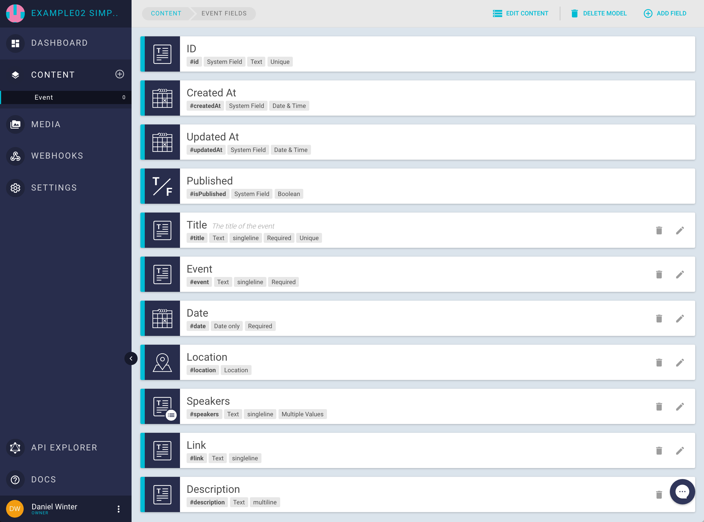
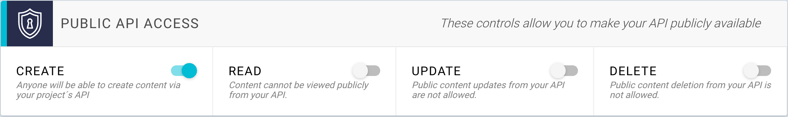
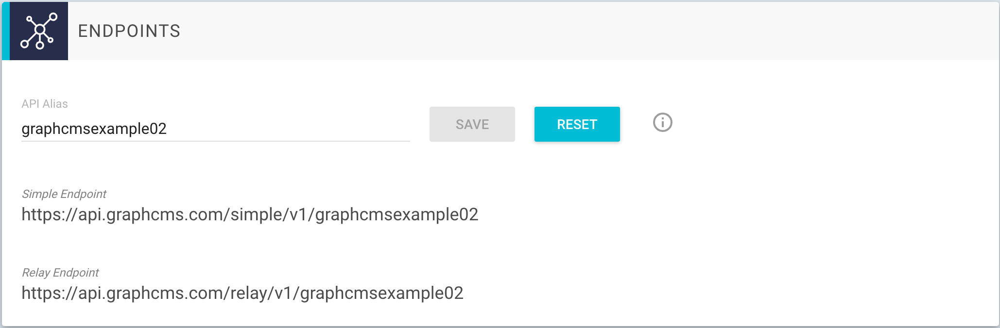

# Import simple data

GraphCMS offers a rich UI to insert new data to you project. Often you have a set of structured data in a JSON or CSV file. Adding this data via the web app can be a lot of repetitive work and a much faster way can be using a simple import script.

This guide explains how to import simple structured data into GraphCMS using a NodeJS script. It is intended to be a starting point and can be easily adapted for your specific use case.

## Data structure

In this example we are going to import a very basic data structure which contains the upcoming GraphQL events. It is stored as a single JSON file `data.json`. Every event has the following attributes:

- title (string, required, unique): The title of the event
- event (string, required): The name of the event
- date (string, required): The date of the event in format: "MM.DD.YYYY"
- location (JSON): The geolocation of the event
    - lat (float): latitude
    - lng (float): longitude
- speakers (string, multiple values): A list of speakers of the event
- link (string): A link to further information of the event
- description (string): Short description of the event

First we have to define the content model in GraphCMS. To do this create a new Project in [GraphCMS](https://app.graphcms.com). Create a new content model using `Event` as `apiId`. Adding the fields is pretty straight forward. Click `EDIT FIELDS` and use the `Field Wizard` to create all fields representing your data structure.

You can see all fields an their attributes created in `GraphCMS` in the screenshots below.



## API Access

By default `GraphCMS` protects your API against unauthorized access, so nobody can create, read, update or delete any content in your project.

To keep things simple this guide will write the sample data without setting up an `authToken` for authentication. To allow write operations you have to allow at least `CREATE` operations on you API. This can be done in the `PUBLIC API ACCESS` section in the `Settings` view of your project. Simply activate the `CREATE` switch as shown in the next screenshot.



Now we are good to go and can write our import script.

## Import script

Next we are going to write a simple script to write the data from our JSON file into your `GraphCMS` project.

One easy way is to use [Lokka](https://github.com/kadirahq/lokka). It is a lightweight GraphQL client which can be used in JavaScript.

We are going to use NodeJS with [Babel](https://babeljs.io) to write ES6 code. To get a cleaner handling of async operations we use the [transform-async-to-generator](https://babeljs.io/docs/plugins/transform-async-to-generator) Bable plugin.

!!! hint ""
    Since GraphQL queries are just simple HTTP request you can use CURL or any programming language you want.


First we have to setup our Lokka client. To do this we need to import the required packages and create a new Lokka instance. We use the Lokka http transport to access our api and need to pass the URL of our API.

In this example we use the `simple api`, the the URL will look like this: `https://api.graphcms.com/simple/v1/$PROJECTID_OR_ALIAS$`. All you have to do is to replace the $PROJECTID_OR_ALIAS$ placeholder with your projectId or the alias.
You can get this URL by copying it from the `Endpoints` section in the projects settings view in GraphCMS:



The next code block shows how to setup the Lokka client:

```
import { Lokka } from 'lokka';
import { Transport } from 'lokka-transport-http';

process.env.TZ = 'UTC'

const client = new Lokka({
  transport: new Transport('https://api.graphcms.com/simple/v1/graphcmsexample02'),
});
```

!!! hint ""
    We need to format the date of each event to `ISO-8601` you have to ensure the timezone is set to `UTC`.


Now we can write a mutation to write an event into your project. To do this we have a simple method `createEvent`, which gets an event object as parameter. Since we call the asynchronous `mutate` method of the Lokka client with `await`, we have to mark this method with `async`:

```
const createEvent = async ({ date, description, event, link, location, speakers, title }) => {
  const mutationResult = await client.mutate(`{
    event: createEvent(
      date: "${new Date(Date.parse(date)).toISOString()}"
      description: "${description}"
      event: "${event}"
      isPublished: true
      link: "${link}"
      location: "${JSON.stringify(location).replace(/\"/g, '\\"')}"
      speakers: ${JSON.stringify(speakers)}
      title: "${title}"
    ) {
      id
    }
  }`);
  return mutationResult.event.id;
};
```

!!! hint ""
    To simplify your development process, you can print out your created mutation string and verify it is valid using a tool like [GraphiQL](https://github.com/graphql/graphiql) or the [GraphCSM API Explorer](http://localhost:8000/Getting_Started/#exploring-the-content-api)

We create and pass a mutation string into the `mutate` method of the Lokka client. This string is a simple GraphQL mutation string, so we have to format the incoming data a little bit.

Simple strings like `event` or `description` can simply be passed as they are and have only be quoted.

Dates must be formatted to be `ISO-8601` conform. As noted above you have to set the process timezone to `UTC`. To format a date string in JavaScript we simply create a new Date object with the parsed date string. Then we can call the `toISOString` method to get the correct formatted date string ready to insert as a GraphQL date.

Another special case is the speakers array. Since GraphQL expects an array of strings, we have to stringify the array without quoting it. We use the `JSON.stringify` method for this.

The last field is the locations object. Here we have to prepend all quotes with a `\` using a simple regex: `.replace(/\"/g, '\\"')`.
The mutation string which gets passed to the Lokka client looks like this:

```
{
  event: createEvent(
    date: "2017-03-27T00:00:00.000Z"
    description: "Johannes Schickling is the co-founder of @graphcool. Graduated from Entrepreneur First 15/16. His personality type is ENTJ. He is also a tuts+ author and passionate about open source, algorithms, math and technology."
    event: "GraphQL London #3"
    isPublished: true
    link: "https://www.meetup.com/GraphQL-London/events/238027448"
    location: "{\"lat\":51.5257433,\"lng\":-0.1421112}"
    speakers: ["Johannes Schickling"]
    title: "Using GraphQL subscriptions with Apollo"
  ) {
    id
  }
}
```

After the mutation is executed we return the id of the inserted record.


The rest of the script simple loads the data to import from the `data.json` file using a simple `require`:

```
const data = require('../data.json');
```

Then we iterate over every entry and call the `createEvent` method. After all Promises have resolved, we print out the number of inserted entries and their ids.

```
const eventIds = await Promise.all(data.map(createEvent));
console.log(`Finished creating ${eventIds.length} events. Ids:`, eventIds);
```


!!! hint ""
    We have configured the field `title` to be unique. If you run the script multiple times it will fail, because reimporting would violate the unique key constraint.

A sample project for the discussed project can be found [Here](https://github.com/GraphCMS/example_02_simple_data_import).
