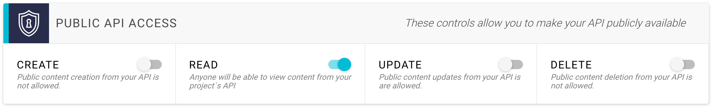

# Public API Access

By default, all GraphCMS content APIs are private. That means that you will only have external access to your content if you send an auth token in the headers of each request. Sometimes, this is not intended. Some users want their API to be public, so that anyone who knows the URL of your GraphQL endpoint will be able to view and manipulate content. You can control this behaviour in the `Settings` view of your project.

The `PUBLIC API ACCESS` panel allows you to set your API public for `CREATE`, `READ`, `UPDATE` and `DELETE` operations.

!!! danger ""
    If you want to open your API to the public, we highly recommend to only allow `READ` operations, so no one will be able to modify and harm your content. Be also aware that all public requests to your API will count against your monthly API quota.
