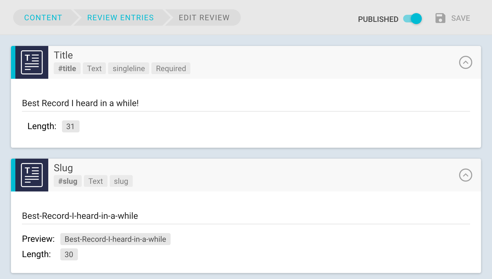
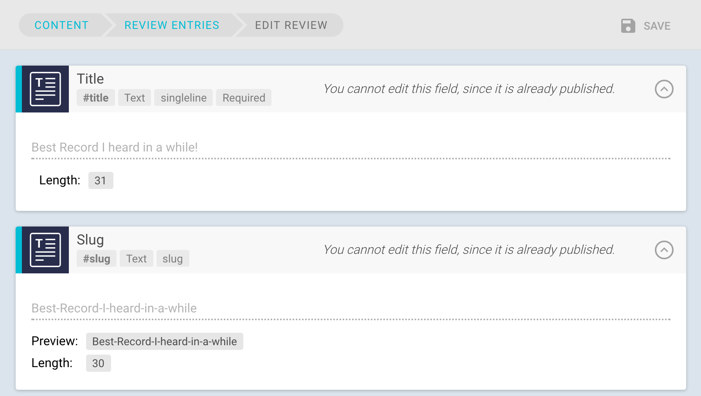

# Publishing workflows

GraphCMS has a  simple, built in publishing workflow that allows you to define which content will be delivered by your API. This lets you create new content and only deliver this content after e.g. a review process was completed.

To `publish` an entry you need to have the required permissions. In GraphCMS all roles except the `CONTRIBUTOR` can publish existing entries. This can be done within the entry form.

To publish an existing entry you have to toggle the `PUBLISHED` toggle at the top of the page. This is shown in the image below. To unpublish an entry simply switch the toggle again.

Publishing entries has no immediate effect for the current user. Published entries are still editable or deletable for non contributor users.

Users with the role `CONTRIBUTOR` however can see published entries, but not edit or delete those entries. Furthermore they do not see the `PUBLISHED` toggle, since they are not allowed to publish entries.

When a contributor opens a published entry, all form inputs and the save button of the form are disabled. An additional info message is shown to notify the user why the inputs are disabled (see image below).

!!! hint ""
    Currently unpublished entries are delivered by the API. In the future those entries won't be delivered. For now, you can add a `filter` to your queries to ignore unpublished entries.
