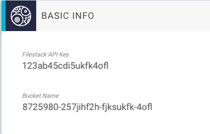

# Uploading Images to GraphCMS

!!! hint
    We use [Filestack](https://www.filestack.com/) as our Asset hoster. If you want to build a fancy uploader, check their API documentation for API usage!

In this guide, we will use a `curl` example to upload data to your project.

To get an image from the hard-drive or from an external URL into GraphCMS, we need to follow 3 steps:

1. Send the image to the Filestack API using the Filestack_api_key and your projectId (Bucket Name)

2. Receiving the response from Filestack, which includes handle, size, url etc.

3. Sending a `createAsset` mutation to your project endpoint to link the image

## Setup - Retrieving the API Key

Before we get started we need our Filestack API Key and our projectId/Bucket name. These are available in your project settings under `Basic Config`



The `Bucket Name` is equivalent to your `projectId`. This is the folder, under which your images are laying in Filestacks S3 storage.

## Step 1 - Sending an Image

To send an image to the Filestack API, we will use `curl`. You can also integrate Filestacks image picker directly in your frontend, if you want to do so.

For sending a file from your hard-drive we would use a command like this:

```bash
curl -X POST -F 'fileUpload=@"<filename with ending or path>"' "https://www.filestackapi.com/api/store/S3?key=<filestackAPIkey>&path=/<projectId>/<filename>"
```

For sending an image from an external URL:

```bash
curl  -X POST  -d  url="<url where image is already hosted>"  "https://www.filestackapi.com/api/store/S3?key=<filestackAPIkey>&path=/<projectId>/<filename>"
```

The last `<fileName>` determined how the image will be called in Filestacks storage, the specific filename will be parsed from the image itself..

## Step 2 - Receiving the response

After we sent the request and everything went through, we should get a response like this:

```json
{"container": "graphcms-dev", "url": "https://cdn.filestackcontent.com/IXJLraciRkafJgsafmpQ", "filename": "asset_settings.png", "key": "86458734-23487294-lfjkf345-53345/settings.png", "type": "image/png", "size": 20049}
```

The URL still points to `cdn.filestackcontent.com`, you need to change that part to `media.graphcms.com` which works like a proxy for the Filestack URL.

## Step 3 - Linking the Image to GraphCMS

In the last step we want to link the image in Filestacks storage to GraphCMS, so it shows up under "Assets" and is queryable from the API.

To do that, we send a `createAsset` mutation to our projects endpoint:

```json
mutation test {
  createAsset (
    url: "https://media.graphcms.com/IXJLraciRkafJgsafmpQ"
    fileName: "asset_settings.png"
    handle: "IXJLraciRkafJgsafmpQ"
    size: 20049
    mimeType: "image/png"
  ) {
    url
    handle
  }
}
```

The `handle` is the key behind the Filestack URL: `https://cdn.filestackcontent.com/HANDLE`. As mentioned you need to rename the first part to `media.graphcms.com`.

The response from this would be:

```json
{
  "data": {
    "createAsset": {
      "url": "https://cdn.filestackcontent.com/IXJLraciRkafJgsafmpQ",
      "handle": "IXJLraciRkafJgsafmpQ"
    }
  }
}
```

We now have successfully linked our image from Filestack to GraphCMS and can now use it in our project.

!!! hint
    If any questions are still open, feel free to contact us in [Slack](https://slack.graphcms.com) or via On-Site-Chat!

## Advanced

Filestack also offers a ready to use file picker for your application. This does basically the same as the first curl command and returns a response with data you need to query in GraphCMS. See the documentation for this [here](https://www.filestack.com/docs/javascript-api/client)!