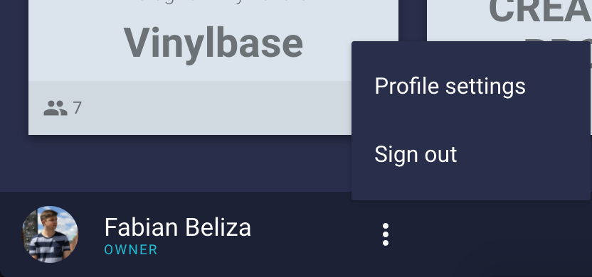
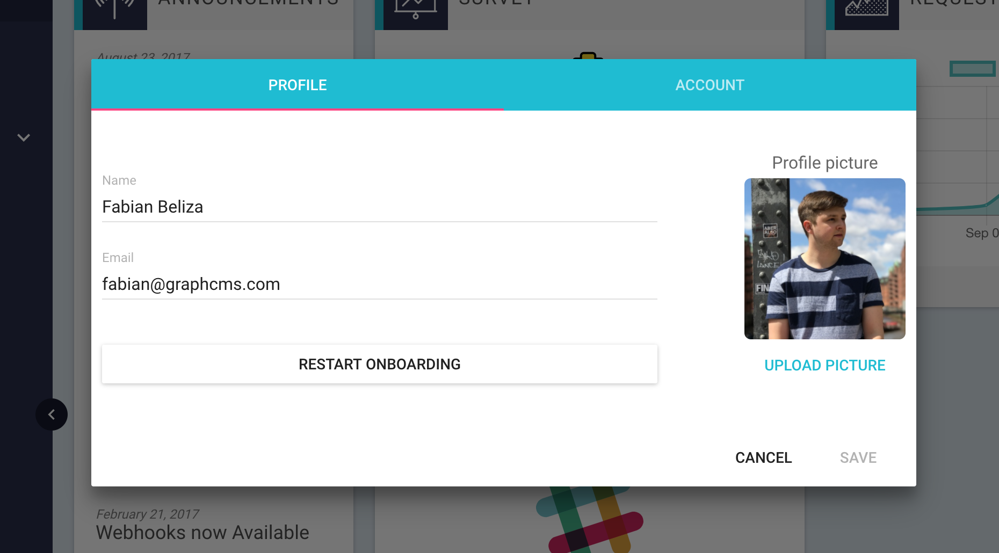
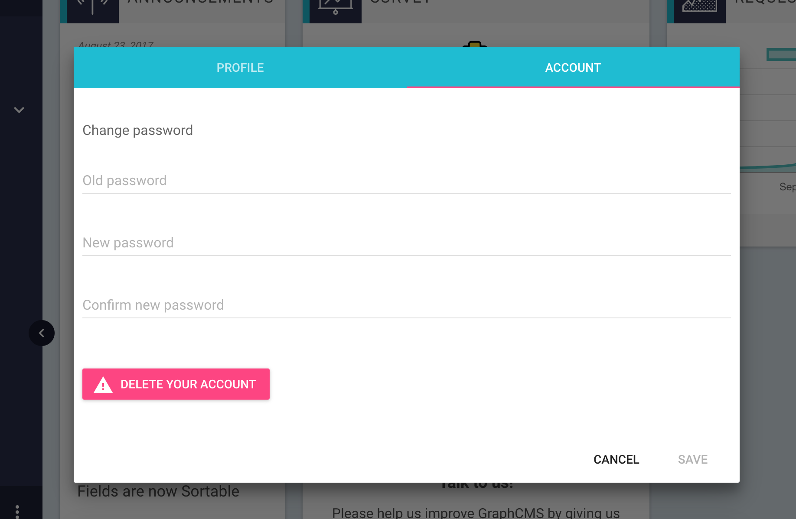

# Profile Settings - Changing Your Email, Name and Password

Changing your profile settings can be done in our special settings view. You can get there by clicking the 3 dots right next to your name on the bottom left corner.

After clicking on *Profile Settings* you will be taken to the first tab of the settings where you can change your full name, email and profile picture.
You can also restart our onboarding tour if you skipped it before or want to do it again.

The second tab is for the account settings, where you can change your password or delete your account (bad idea!)

