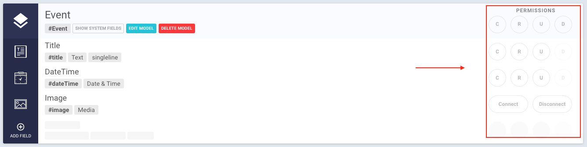
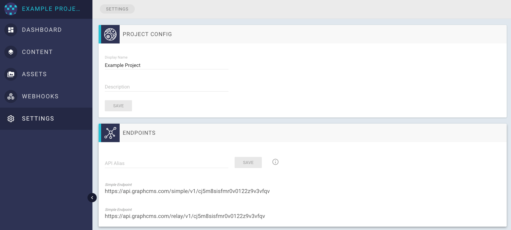

# Using Permissions

All of your content is private by default. With our *Permission System* you can configure CRUD-Operations either for each model or for each field individually. This gives you control over what can be done to fields or models via your endpoints.

## Permission View

The Permission settings can be found next to each model and field in the *Content* view.

Each CRUD-Operation has a dedicated button to toggle it on or off. `Create`, `Read` and `Update` can be toggled for the entire model or for every field individually. `Delete` can only be toggled for the whole model, since you can not delete fields individually.

The Permissions for Assets and Relations look a little different. You have the option to `Connect` or `Disconnect`. Connection makes your relation accessible through the API. Disconnect does the exact opposite - your relation can not be modified or seen via the API.

Trying to Create, Read or Update a model or field which is not made available through permissions will result in an `Insufficient Permission` error.

## Endpoints

Your Endpoints can be found under `Settings > Endpoints`. Just click on the link to copy it into your clipboard. Paste it in a new browser tab to test your permissions.

