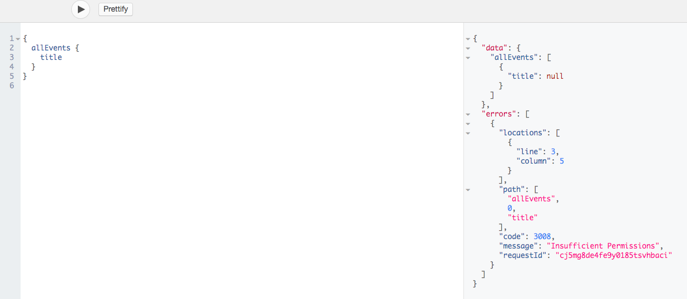

# Using Permissions

All of your content is private by default, which means that your content can't be accessed outside of the CMS. With our *Permission System*, you can configure CRUD-Operations (Create/Read/Update/Delete) either for models or for each field individually. This gives you control over what can be queried, updated or created from your generated content API.

## Permission View

The Permission settings can be found next to each model and field in the *Content* view.

Each CRUD-Operation has a dedicated button to toggle it on or off. `Create`, `Read` and `Update` can be toggled for the entire model or for every field individually. `Delete` can only be toggled for the whole model, since you can't delete fields individually.

The Permissions for Assets and Relations look a little different. They have the option to `Connect` and  `Disconnect`. 
If you enable the `Connect` toggle button, you will be able to add entries to the relation (e.g. `mutation { addToAssetEventPicture(...) }` - adding a picture to an event). 
If you enable the `Disconnect` toggle button, you will be able to remove entries from a relation (e.g. `mutation { removeFromEventParticipant(...) }` - removing a participant from an event).

## Creating and modifying data through your endpoint

Whenever you are trying to modify your content via your endpoint you need to make sure to enable all the necessary permissons for these operations. For example: You want to create a new entry for your model. Make sure you have the create permisson toggled for your input fields in order for it to work.

## Testing your permissions

The easiest way to test your permissions is to copy and paste one of your endpoint URLs in a new browser tab. This will let you browse your API with the permissions you defined.

Your endpoints can be found under `Settings > Endpoints`.

Trying to Create, Read or Update a model or field which is not made available through permissions will result in an `Insufficient Permission` error.

