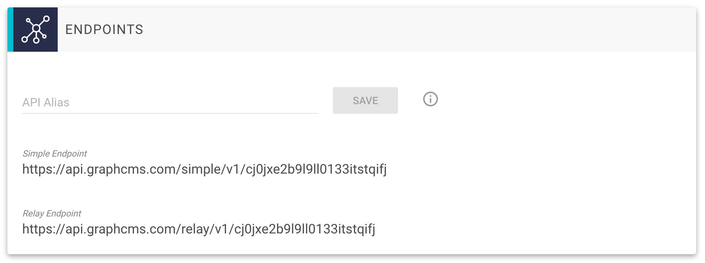

# Using Aliases for your API

GraphCMS creates automatically two APIs for your content:

* [Simple API](/API_simple)
* [Relay API](/API_relay)

You can access the endpoints by using the following default URLs:

- Simple: `https://api.graphcms.com/simple/v1/<projectId>`
- Relay: `https://api.graphcms.com/relay/v1/<projectId>`

To find those URLs, go to the `Settings` view in GraphCMS and take a look at the `Endpoints` section (see the screenshot below):

You can replace the `projectId` in the URLs with your own `alias`. If you set up an alias, i.e. `graphcmsalias` this will change your URLs like this:

- Simple: `https://api.graphcms.com/simple/v1/graphcmsalias`
- Relay: `https://api.graphcms.com/relay/v1/graphcmsalias`

!!! warning ""
    Please remember that project aliases must be _globally_ unique. If another user has taken the alias already, you cannot use it in your project.

!!! hint ""
    If you set up an alias for your project, you can still use the default URLs of your API.
