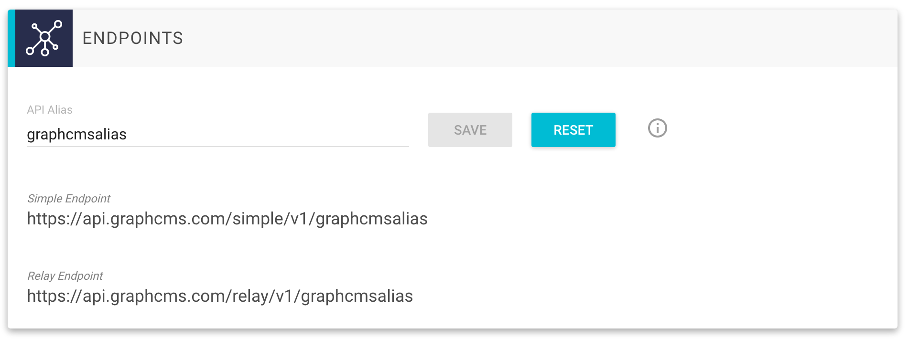

# Using Aliases for your API

GraphCMS creates automatically an API for your project containing all your setup content models. There are two different APIs: [simple](http://localhost:8000/API_simple/) and [relay](http://localhost:8000/API_relay/).

You can access those APIs by using the following default URLs:

- Simple: `https://api.graphcms.com/simple/v1/<projectId>`
- Relay: `https://api.graphcms.com/relay/v1/<projectId>`

To find those URLs go to the settings view in GraphCMS and take a look at the `Endpoints` section (see the screenshot below):

You can replace the `projectId` in those URLs by your own `alias`. If you setup an alias `graphcmstesting` this will change your urls like this:

- Simple: `https://api.graphcms.com/simple/v1/graphcmstesting`
- Relay: `https://api.graphcms.com/relay/v1/graphcmstesting`

!!! warning ""
    Please remember that project aliases must be _globally_ unique. If another user has taken this alias, you cannot use it in your project.

!!! hint ""
    If you setup an alias for your project, you can still use the default URLs of the API.
