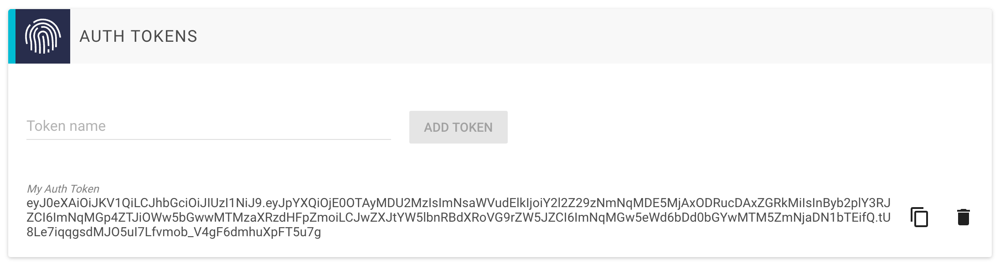
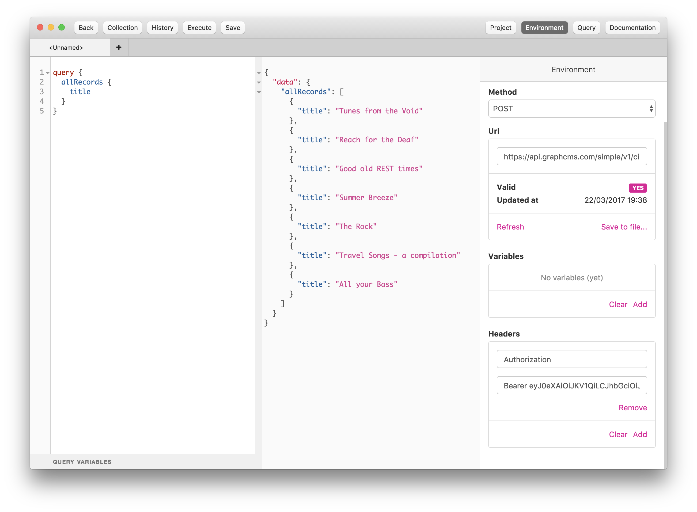

# Using Permanent Auth Tokens

By default, all GraphCMS content APIs are private, so your API is protected from outside access. To access your content from an external client, like a web browser or a native mobile app, you will need to create a `permanent auth token` and assign it to your application. This token needs to be sent with each request to your GraphCMS API.

This will allow your external client to:

* `CREATE` new content entries
* `READ` existing content entries
* `UPDATE` existing content entries
* `DELETE` existing content entries

!!! warning ""
    Be careful! Anyone that gains access to one of your tokens will be able to execute all of these operations and manipulate your content. So it is never a good idea to store a token on the client side, i.e. a JavaScript client application.

    We will soon release a feature that will allow you to create `read-only tokens`, so even if someone gains access to such a token, your data will be safe from manipulation.

!!! hint ""
    As an alternative, you can set up public access for create, read, update and delete operations ([see here](/guides/Public_API_access)). This will allow you to skip the token step.

You can create auth tokens in your project´s `Settings` view.



After creation, you need to assign the token with each HTTP request to the server. This is done using the `HTTP Authorization Header`:

```
Authorization: Bearer <token>
```

Any request to the server that contains a valid token will be able to create, read, update and even delete data. If the token is invalid, an error will be returned.

## Connecting GraphQL IDE to your Backend

The [GraphQL IDE](https://github.com/redound/graphql-ide) is a handy tool for GraphQL development. To quickly demonstrate how to authenticate with an auth token, we create a new project in the IDE.

First you need to enter your GraphCMS project´s endpoint URL, which you can find in your project´s `Settings` view.

After this, you just need to add the `HTTP Authorization Header` with `Bearer <token>` as header value (see screenshot below).


