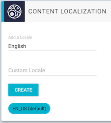
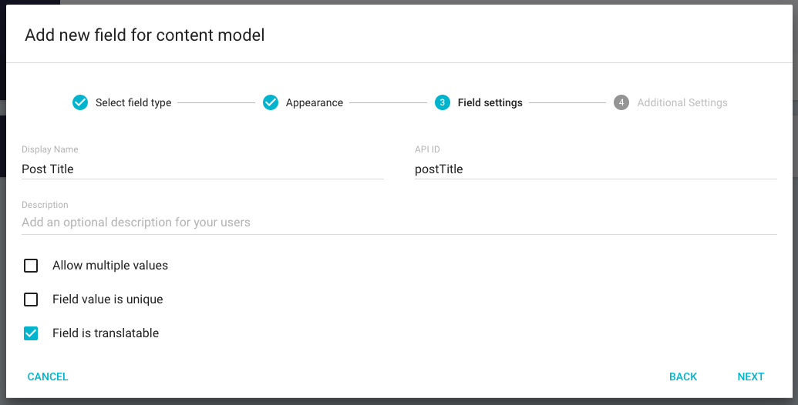
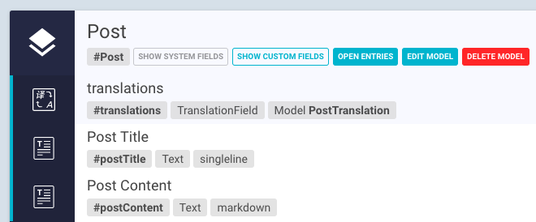

# Using Translations

This guide will illustrate the usage of our localization feature. 

## Setup

!!! hint " "
    Translations can only be activated for new fields. Once a field is created without "isTranslatable" you cannot make is translatable afterwards!

Before diving into the content creation we want to setup our project for the locales we need later. To set this up, we go into "Settings" and scroll to "Content Localization"

Here you can now search for existing languages and add them to your collection. When clicking on the language abbreviation you set it as default.

<video controls>
  <source src="/../img/guides/translations/AddNewLocale.mp4" type="video/mp4">
Your browser does not support the video tag.
</video>

## Adding Translatable Fields

We can now switch back to the "Model" View and create new model or use a existing one. To this model we will now add some fields which we mark as "Field is translatable"

The Model View should now look something like this:

## Creating Localized Content

<video height="600px" controls>
  <source src="/../img/guides/translations/CreatePostTranslate.mp4" type="video/mp4">
Your browser does not support the video tag.
</video>

