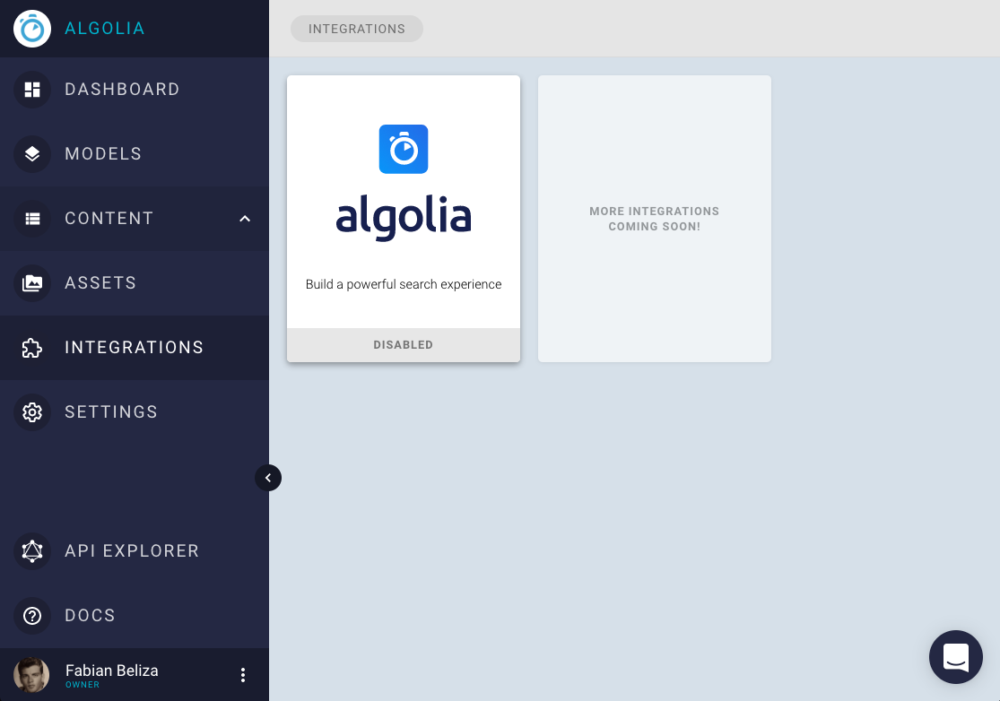
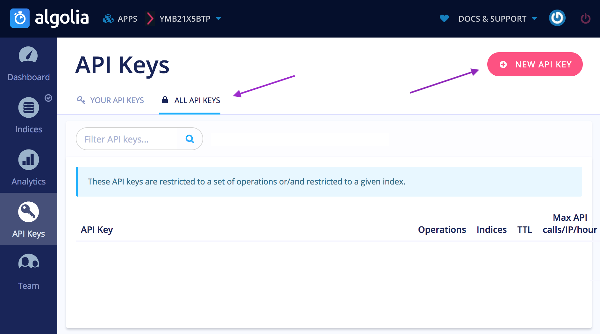
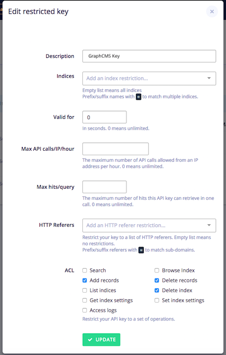

# Algolia

!!! Hint ""
    All of Algolias indexing is not covered within our pricing plans, so you might create extra costs with a lot of indices or records. Algolias free community plan includes 10.000 records and 100.000 operations and you have to display their logo on your search results.

To get started with Algolia you firstly need an [Algolia Account](https://www.algolia.com/users/sign_up). In the next step you log into your GraphCMS project dashboard and choose "Integrations" in the left menu bar. There you select "Algolia".

You will be prompted with your Algolia `Application ID` and `API Key`. To retrieve them you switch back to your Algolia dashboard and select API Keys on the menu. The first entry there is your `Application ID`. 

Next we need to create an `API Key`. Click on *"All API Keys"* and then *"New API Key"*.

The new API Key needs to have *"Add records"*, *"Delete Records"* and *Delete Index* checked.

Now you can copy & paste both the `Application ID` and `API Key` in the GraphCMS prompt.

You will then be redirected to the Algolia configuration. From here you can create indices.

