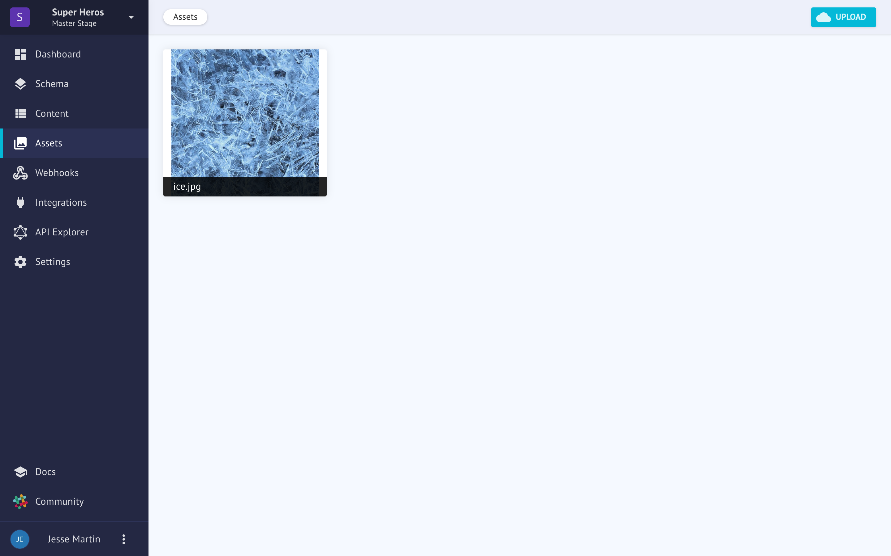
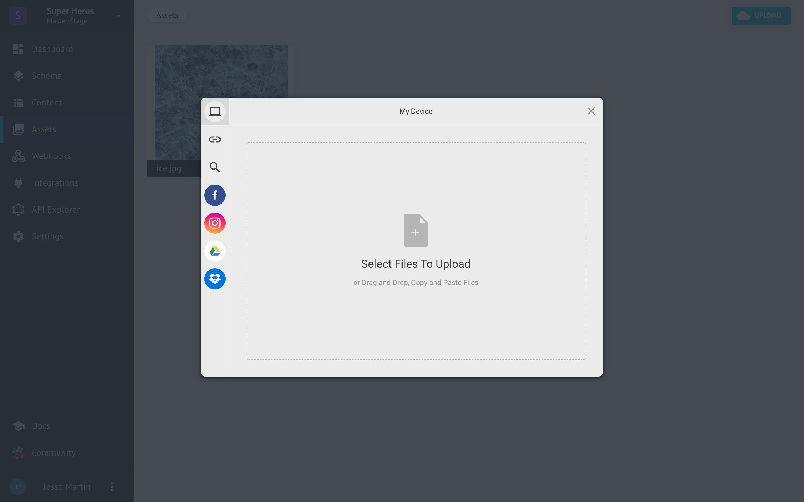
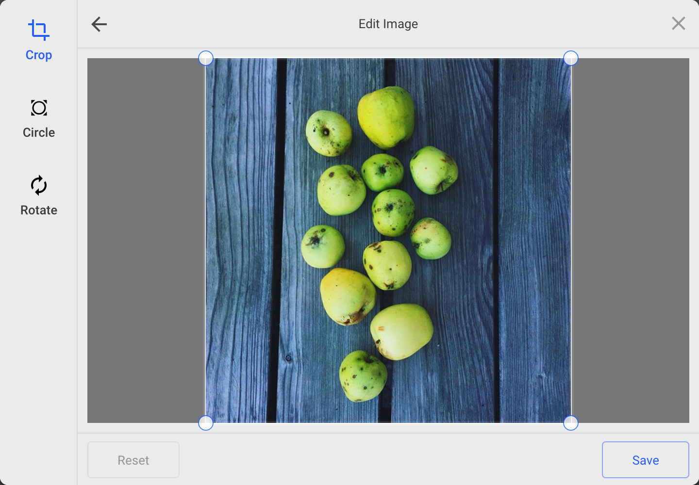
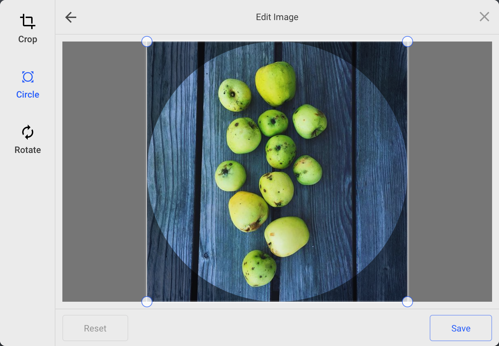
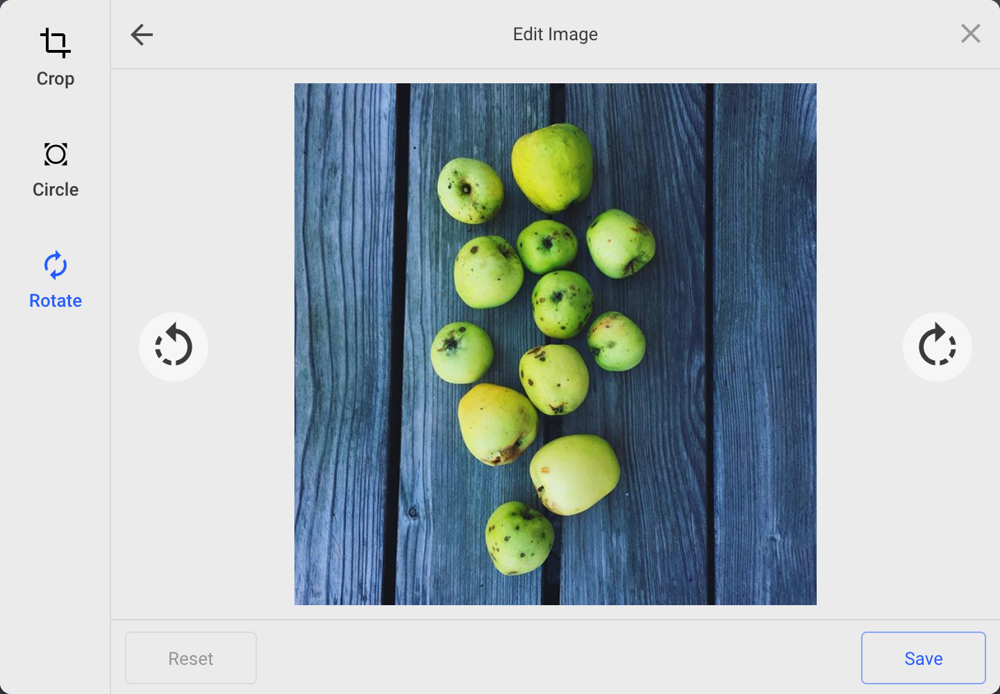

# Assets
Images can be uploaded from the asset view, or directly from an asset field that is used in your content model.

Under the hood, an asset is just another content model but also supports special methods and utilities for developers. For users, images are also commonly handled differently with their own unique workflow such as gathering permissions, managing edits and optimizing variations for different platforms.

## The Window
At it's most basic, the assets window looks like this:

From here, you can upload a file from various service providers.

They are:
* My Device (Your current device)
* Link (URL)
* Web Search
* Facebook
* Instagram
* Google Drive
* Dropbox

These assets will be available both in other models and to query on their own for ultimate gallery action.

You have three options for editing an image:

| Crop | Circle Crop | Rotate |
|---|---|---|
|  |  |  |

Those with developer access and are comfortable writing queries have a wide array of methods available to manipulate images for common patterns in modern web design. You can read more about that at the [developer docs for assets](../../developers/assets).