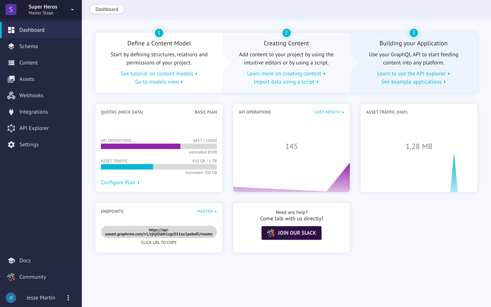
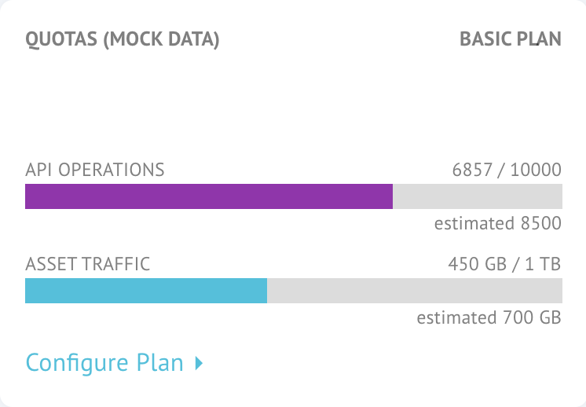
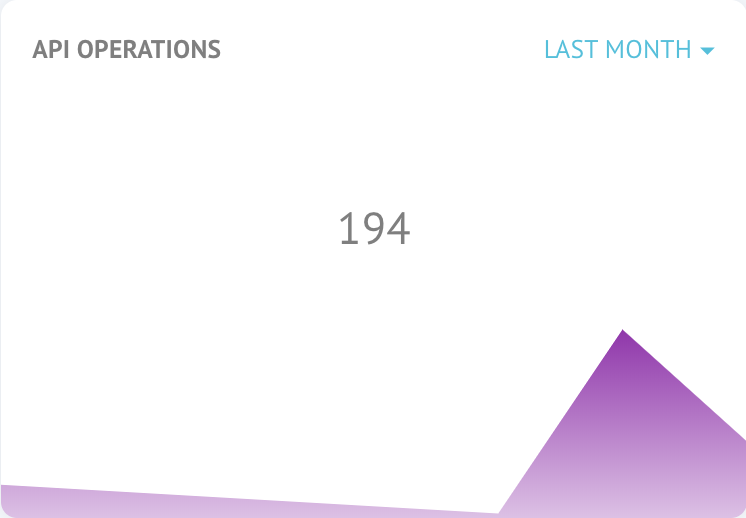
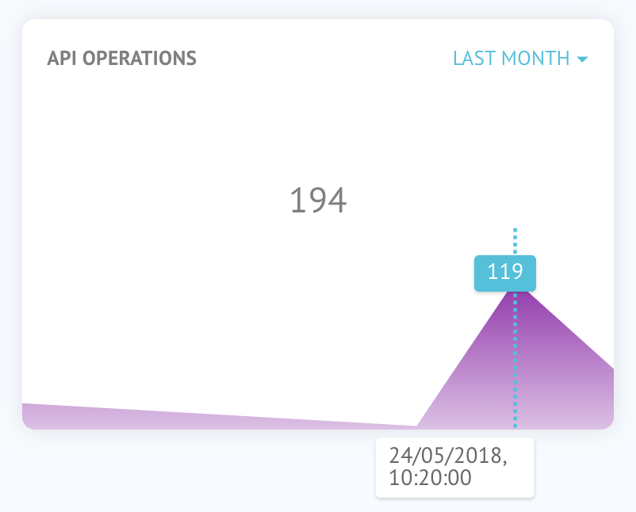
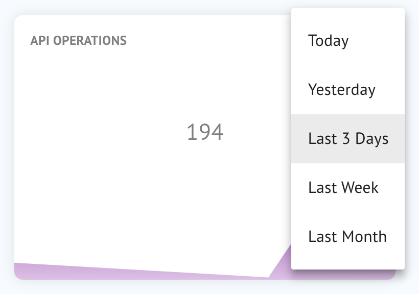
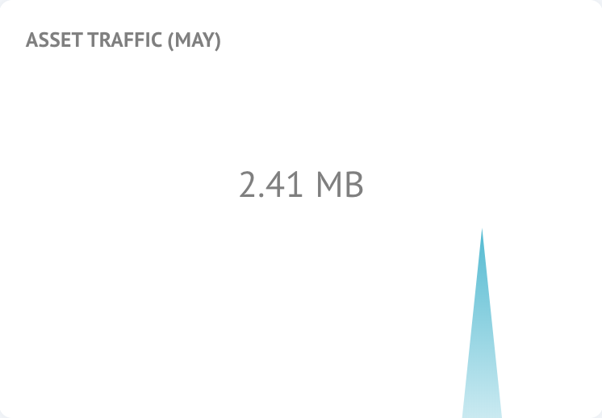
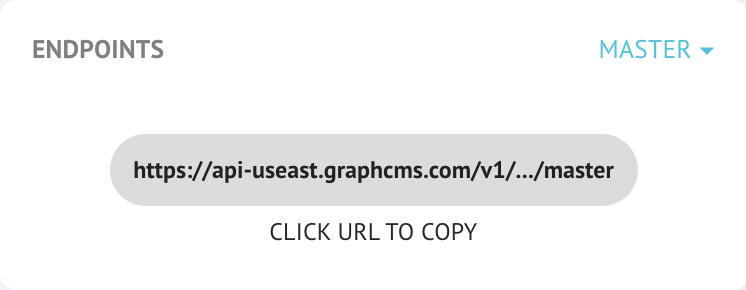
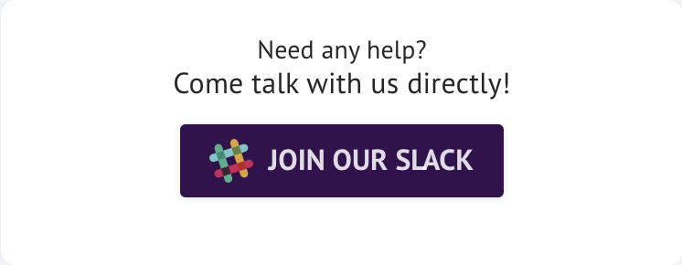

# The Dashboard
The dashboard gives you an overview of your entire project. Here, you can find your project endpoint as well as how much of your quota you have used for API operations (queries, mutations) and asset traffic (views, downloads, etc).

You'll also find rudimentary usage statistics to help you diagnose spike days in traffic.

## Quota Overview
Each plan offers a certain number of server requests (queries and mutations) as well as data transfer (showing your images, files) per month. For a breakdown on how much each plan offers, [please see the pricing page](https://graphcms.com/pricing).

Along with the actual usage and the total allowed, we offer a helpful estimation what your monthly usage will be based on current usage. As the month goes on, this number will update and increase in accuracy.

## API Statistics
The API overview shows the peak days of activity for your content. If something seems out of sync with your expectation, this is a very helpful place to track down abnormalities or simply to bask in the glow of your super popular content!

When you hover over the content, you can see specific dates involved.

You can also increase the date range to view bigger-picture statistics.

## Asset Statistics
Similar to API statistics, asset statistics show you which days your assets were viewed and when how much data was transferred. Again, this serves as a helpful diagnostic tool in auditing your costs and expectation for how your front-end should be behaving.

## Endpoint
The all-important endpoint is the single most important URL for your GraphCMS project to work! In fact, it's the ONLY URL you need to make your project work! Since all queries and mutations are written against a single endpoint, we've added a helper utility. Just click on the URL and we'll copy it to your clipboard.


If you add an alias or are working on a different [stage](./stages.md), those changes will be visible here.


## Get Help
No product can be truly great without a great community, and ours here at GraphCMS is no exception! [Join our Slack channel](https://slack.graphcms.com) for access to one of the happiest, smartest and helpful group of developers around! Just prepare yourself for party parrots. It's a thing.

