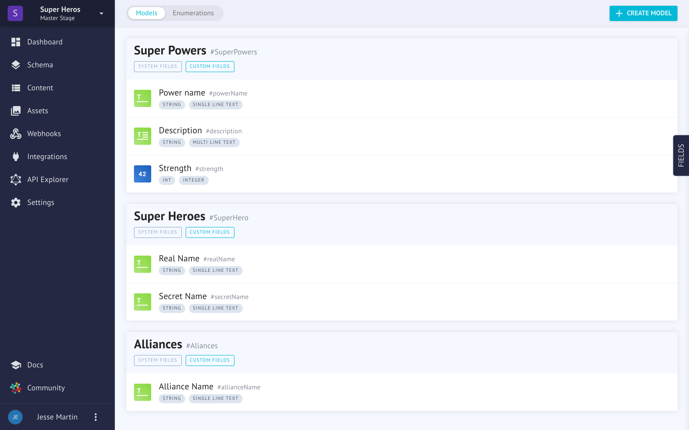
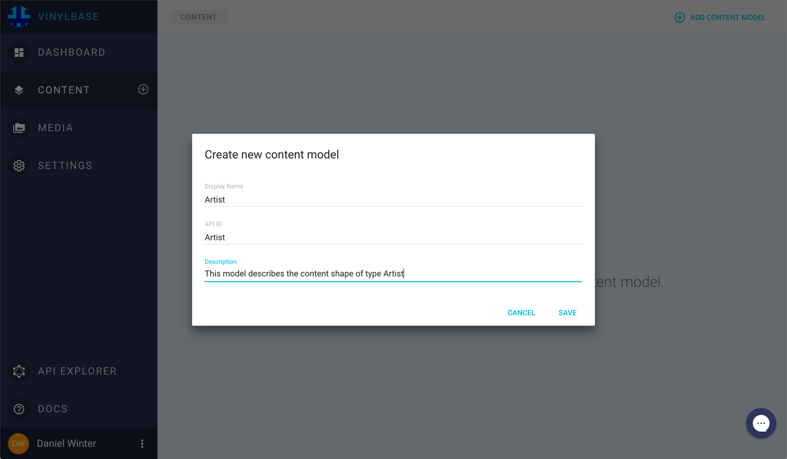

# Models
Models will makeup 90% or more of your project. When you create a structure such as `Author`, `Book`, `Publisher` and `Book Club`, these are nearly exclusively Models. Any time the content contains multiple values, you can be sure you want a model.

This is a contrast to [Enumerations](enumerations.md) which are a finite list of options that are themselves just one value. This could represent `In Print, Out of Print` options on your `Book` model, for example.

## Creating a Model
Creating a model is very easy! Click on the blue button "Create Model" and you'll be presented with a screen like this.

### Display Name
This helps you identify the Model in your interface.
### API ID
This is generated for you automatically, but you can rename it if you want. Generally you will just leave this as we suggest.
### Description
A small description for you to remember the intended use of this model.

## Fields
Out of the box, we offer a complete set of field types for you to work with. We will look at them in depth here.

### Single line text
Single line text can be considered like a proper noun. A super hero is a type of person, that's a model in general. A Super Hero's name is unique and won't be typically shared with another Super Hero. A unique string is a good option here.

#### Supported Fields
| Name | Required | Function |
| ---  | ---      | ---      |
| | |

### Multi line text
Because of how databases work, its helpful to distinguish between small text fields and big text fields. Generally speaking, smaller text fields are more efficient. However they're not idea for, well, long text. Use these to describe your Super Hero's bio.
### Markdown
For really long text, or just for when you are feeling fancy, markdown is the lingua franca on the web for content editors these days. So, of course, we've got you covered. This could be used to regale readers with your Super Hero's long backstory.
### Integer
Integers are for round numbers. Consider this for an age field.
### Float
Again, for efficiency sake, numbers have been split into different types for technical reasons. Floats are numbers which can have decimals in them. This would be good for fine tune numbers like Super Hero strength.
### Checkbox
For those yes/no options, checkboxes are the go-to solution. Is the Super Hero retired?
### Date
Quite simple, this could be a Super Hero birth date or the start of their Super Heroism. You decide.
### DateTime
*Again*, another example of identical data types all for technical reasons! We get it can be annoying, but choosing the most simple form your data can take will make your app run faster. Date and Time fields, for when the seconds matter.
### Json
*Warning, nerd alert!* JSON is meant for people who understand what JSON is. It's a type of data object that can store as much data as you want. Sometimes you will be bringing over data from another system, and you simply don't have time to recreate all the data with out beautiful fields. If you can get your old data in JSON format, just stick it in here and call it a day.

Adventurous users will imagine what kinds of possibilities could be had by using the JSON field and our webhooks!
### Asset

### Enumeration
### Relation

## Inspecting the Model

## Editing the Model

## Deleting the Model
