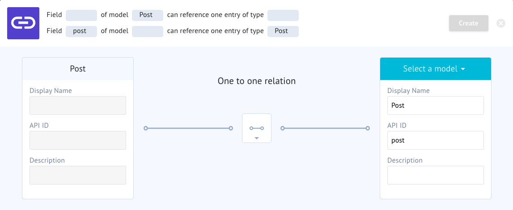
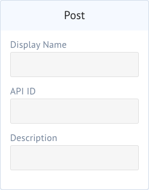
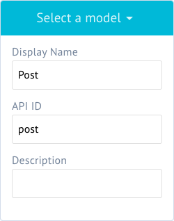
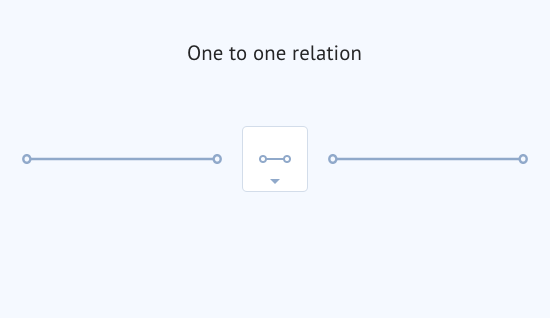
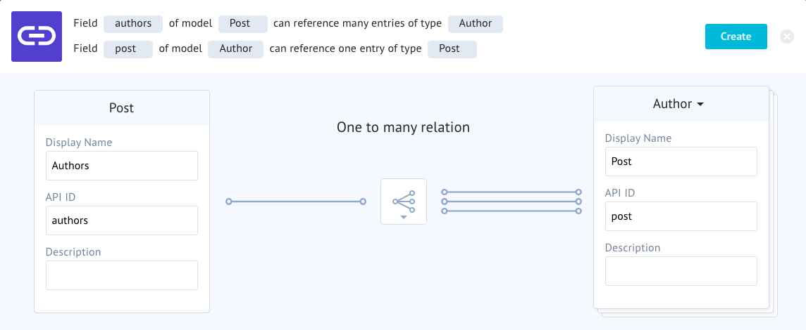
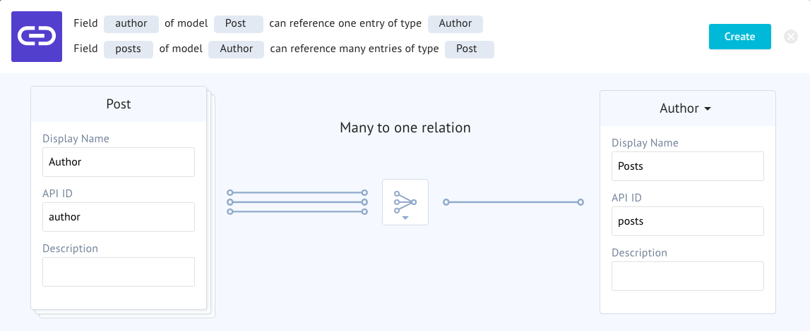
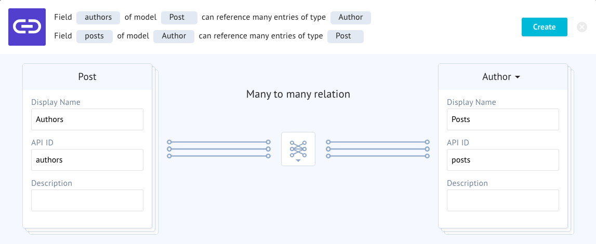

# Relations
Relations are where the magic of graph networks begin to shine. The more models you have that reference other models, the more power you have in representing a complete picture of your data.

In GraphCMS, the relations field is called "connect" - which is a reference to the technology under the hood that makes it happen. Just know that when people speak about relations or connections, they are fundamentally referring to the same concept.

## Parts of the Interface
The relations interface looks like this.

### Description Field
  
The description field updates to explain the expected behavior of the relationship action.

### Host Model
  
The Host model is the initial model that initiated the relationship. This is the model you added the Connect field to.

### Connected Model
  
The Connected Model is the one you are connecting to the Host.

### Relationship

The relationship describes what the type of relationship is being created.

## Types of Relationship

### One to One

This describes one author can only have one post and one post can only have one author. This kind of relationship is probably not what we want for this example.

### One to Many

This describes one post having many authors, but authors cannot author more than one post. This is also not a great option for this example.

### Many to One

This example describes one author having written many posts. This is a good candidate for our example.

### Many to Many

For the ultimate flexibility, this example says that authors can write as many posts as they want and more than one author can write the same post.

You might be tempted to ask why not just create Many to Many for all relationships? Enforcing logical restrictions helps us developers make reasonable assumptions about the data they can expect and allows designers to model accurate views of that data. When possible, try to keep your data model as restricted as possible but as flexible as needed.

<!-- ## Further Reading TODO: Add links about graph thinking-->