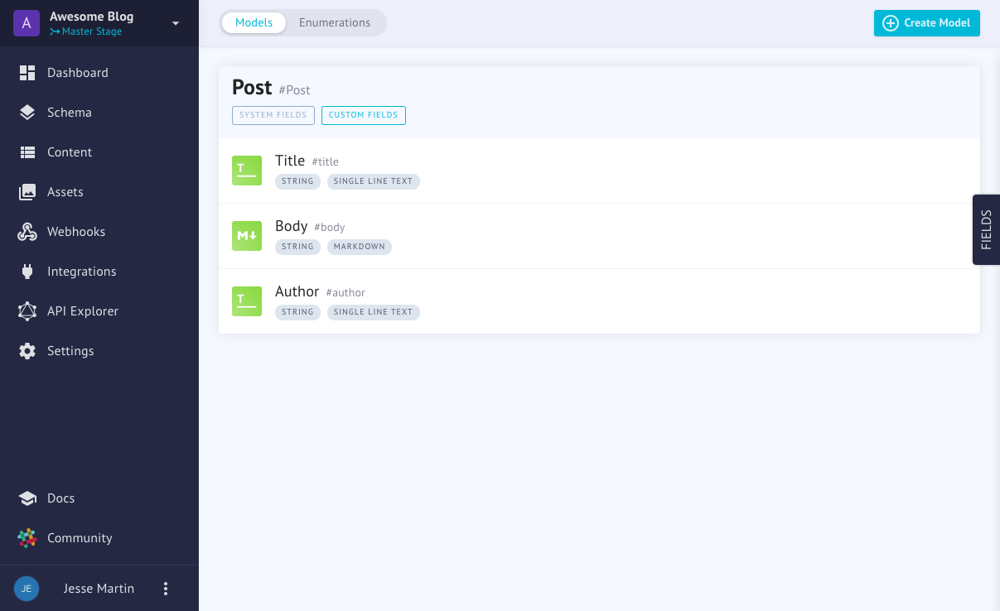
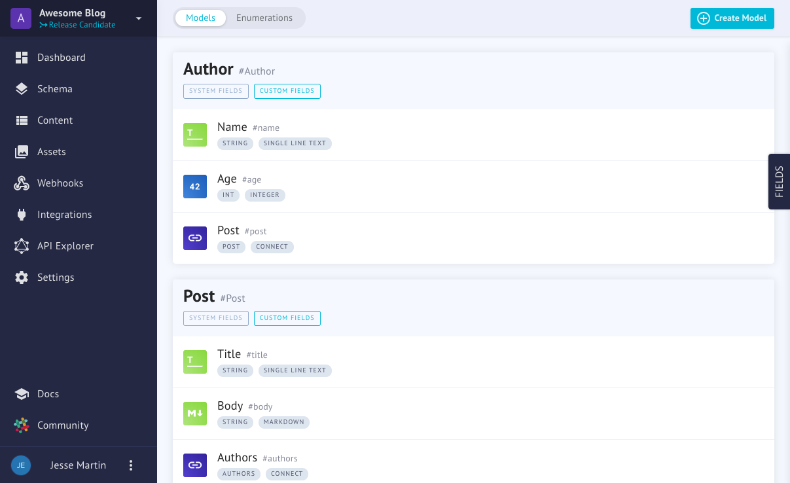
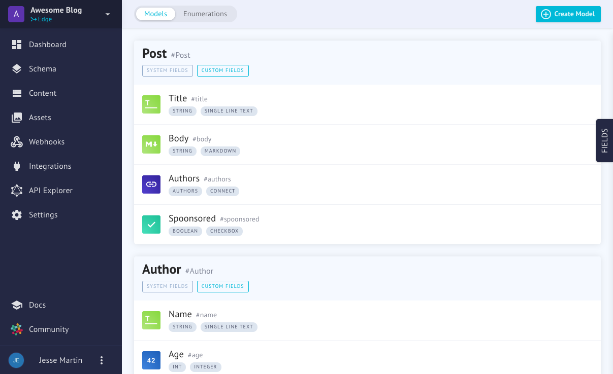
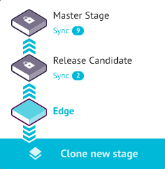

# Stages

Stages are an all new feature in GraphCMS. While simple in concept, they have been a much requested feature. Stages allow you to try out new ideas and changes to your project structure without affecting your production environment.

If you want to overhaul your website or make some major changes, you can simply copy your current stage into a new one and test out your new idea.

Let's see how that looks.

<!-- TODO: Reduce images to relevant component -->

| Stage | Changes | Image |
|---|---|---|
| Master | Initial Model |  |
| Release Candidate | Add a dynamic `Author` Model |  |
| Edge | Add a `Sponsorsip` check |  |

With stages, you can work in a secure an efficient manner, always keeping your approved content structure protected from your latest idea and exploration.

## Key Concepts

### The Master Stage
By default, all projects have one stage called `Master` which is the production environment for your content. If you have a live project running, any changes you make here will be live!

### Clone a new Stage
Creating a new stage is called "Cloning." Why? Because at it's creation, a  new stage is an exact copy of the previous stage – a clone.

### Deleting a Stage
Deleting a stage is straight forward. Click on the Stage drop-down, hover over the stage you want to delete and then press the trash can. You will be asked to type the name of the stage to confirm you really want to delete it and then the command will be executed.

### Syncing Changes (WIP)
An important concept is that only the last clone is editable. So, if you create `Master`, `Release Candidate` and `Edge` stages, only `Edge` is editable. We are working quickly to improve this flow, but for now, you'll need to sync your changes to the previous stage.

<!-- Here's how the sync dialog looks -->
<!--  -->
<!-- TODO: Add gif for syncing -->

The stage dialog shows an indication of how many changes will occur. In the future we will also give you a detailed analysis of what was changed.

